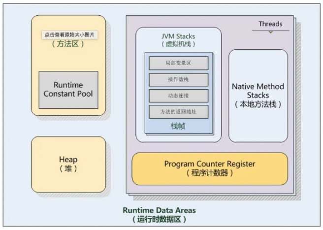

# JVM -- 内存模型(jmm)

> https://www.jianshu.com/p/76959115d486

根据java虚拟机规范，java虚拟机管理的内存将分为下面五大区域。

1. 程序计数器

> 程序计数器是一块很小的内存空间，它是线程私有的，可以认作为当前线程的行号指示器。

2. Java栈（虚拟机栈）

> 同计数器也为线程私有，生命周期与相同，就是我们平时说的栈，栈描述的是Java方法执行的内存模型。

> 每个方法被执行的时候都会创建一个栈帧用于存储局部变量表，操作栈，动态链接，方法出口等信息。每一个方法被调用的过程就对应一个栈帧在虚拟机栈中从入栈到出栈的过程。【栈先进后出，下图栈1先进最后出来】

3. 本地方法栈

> 本地方法栈是与虚拟机栈发挥的作用十分相似,区别是虚拟机栈执行的是Java方法(也就是字节码)服务，而本地方法栈则为虚拟机使用到的native方法服务，可能底层调用的c或者c++,我们打开jdk安装目录可以看到也有很多用c编写的文件，可能就是native方法所调用的c代码。

4. 堆

> 对于大多数应用来说，堆是java虚拟机管理内存最大的一块内存区域，因为堆存放的对象是线程共享的，所以多线程的时候也需要同步机制。因此需要重点了解下。

> java虚拟机规范对这块的描述是:所有对象实例及数组都要在堆上分配内存，但随着JIT编译器的发展和逃逸分析技术的成熟，这个说法也不是那么绝对，但是大多数情况都是这样的。

5. 方法区

> 方法区同堆一样，是所有线程共享的内存区域，为了区分堆，又被称为非堆。
用于存储已被虚拟机加载的类信息、常量、静态变量，如static修饰的变量加载类的时候就被加载到方法区中。