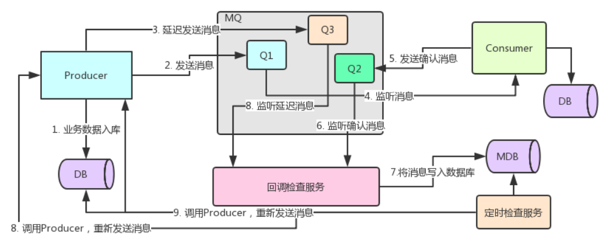
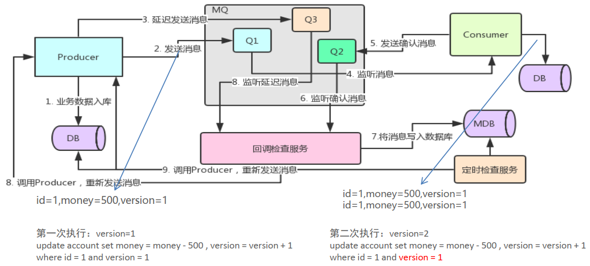

# RabbitMQ

> [官网https://rabbitmq.com](https://rabbitmq.com/)

## 一 基本概念

### 1 MQ概述

MQ全称 Message Queue（消息队列），是在消息的传输过程中保存消息的容器。多用于分布式系统之间进行通信。

### 2 MQ优点

- 应用解耦：提高系统容错性和可维护性
- 异步提速：提升用户体验和系统吞吐量
- 削峰填谷：提高系统稳定性

### 3 MQ缺点

- 系统可用性降低：系统引入的外部依赖越多，系统稳定性越差。一旦 MQ 宕机，就会对业务造成影响。如何保证MQ的高可用？
- 系统复杂度提高：MQ 的加入大大增加了系统的复杂度，以前系统间是同步的远程调用，现在是通过 MQ 进行异步调用。如何保证消息没有被重复消费？怎么处理消息丢失情况？那么保证消息传递的顺序性？
- 一致性问题：A 系统处理完业务，通过 MQ 给B、 C、 D三个系统发消息数据，如果 B 系统、 C 系统处理成功， D 系统处理失败。如何保证消息数据处理的一致性？

### 4 常见的MQ产品

目前业界有很多的 MQ 产品，例如 RabbitMQ、 RocketMQ、 ActiveMQ、 Kafka、 ZeroMQ、 MetaMq等，
也有直接使用 Redis 充当消息队列的案例，而这些消息队列产品，各有侧重，在实际选型时，需要结合自身需
求及 MQ 产品特征，综合考虑。


|#|RabbitMQ|ActiveMQ|RocketMQ|Kafka|
|:---:|---|---|---|---|
公司/社区|Rabbit|Apache|阿里|Apache
开发语言| Erlang| Java| Java| Scala&Java
协议支持| AMQP， XMPP， SMTP，STOMP|OpenWire,STOMP，REST,XMPP,AMQP| 自定义| 自定义协议，社区封装 了http协议支持
客户端支持语言| 官方支持Erlang， Java，Ruby等,社区产出多种API，几乎支持所有语言|Java， C， C++，Python， PHP，Perl， .net等|Java， C++（不成熟）|官方支持Java,社区产出多种API，如PHP，Python等
单机吞吐量| 万级（其次） |万级（最差） |十万级（最好） |十万级（次之）
消息延迟 |微妙级 |毫秒级 |毫秒级 |毫秒以内
功能特性|并发能力强，性能极其好，延时低，社区活跃，管理界面丰富|老牌产品，成熟度高，文档较多|MQ功能比较完备，扩展性佳|只支持主要的MQ功能，毕竟是为大数据领域准备的。


## 二 RabbitMQ

### 1 RabbitMQ简介

#### AMQP
AMQP， 即 Advanced Message Queuing Protocol（高级消息队列协议），是一个网络协议，是应用层协议的一个开放标准，为面向消息的中间件设计。基于此协议的客户端与消息中间件可传递消息，并不受客户端/中间件不同产品，不同的开发语言等条件的限制。 2006年， AMQP 规范发布。 类比HTTP。

#### RabbitMQ
2007年， Rabbit 技术公司基于 AMQP 标准开发的 RabbitMQ 1.0 发布。 RabbitMQ 采用 Erlang 语言开发。Erlang 语言由 Ericson 设计，专门为开发高并发和分布式系统的一种语言，在电信领域使用广泛。

#### JMS
- JMS 即 Java 消息服务（JavaMessage Service）应用程序接口，是一个 Java 平台中关于面向消息中间件的API
- JMS 是 JavaEE 规范中的一种， 类比JDBC
- 很多消息中间件都实现了JMS规范，例如： ActiveMQ。 RabbitMQ 官方没有提供 JMS 的实现包，但是开源社区有


#### RabbitMQ 相关概念

- Broker： 接收和分发消息的应用， RabbitMQ Server就是 Message Broker
- Virtual host： 出于多租户和安全因素设计的，把 AMQP 的基本组件划分到一个虚拟的分组中，类似于网络中的 namespace 概念。当多个不同的用户使用同一个 RabbitMQ server 提供的服务时，可以划分出多个vhost，每个用户在自己的 vhost 创建 exchange／ queue 等
- Connection： publisher／ consumer 和 broker 之间的 TCP 连接
- Channel： 如果每一次访问 RabbitMQ 都建立一个 Connection，在消息量大的时候建立 TCP Connection的开销将是巨大的，效率也较低。 Channel 是在 connection 内部建立的逻辑连接，如果应用程序支持多线程，通常每个thread创建单独的 channel 进行通讯， AMQP method 包含了channel id 帮助客户端和message broker 识别 hannel，所以 channel 之间是完全隔离的。 Channel 作为轻量级的 Connection极大减少了操作系统建立 TCP connection 的开销
- Exchange： message 到达 broker 的第一站，根据分发规则，匹配查询表中的 routing key，分发消息到queue 中去。常用的类型有： direct (point-to-point), topic (publish-subscribe) and fanout (multicast)
- Queue： 消息最终被送到这里等待 consumer 取走
- Binding： exchange 和 queue 之间的虚拟连接， binding 中可以包含 routing key。 Binding 信息被保存到 exchange 中的查询表中，用于 message 的分发依据


### 2 RabbitMQ的工作模式


#### 1 简单模式 HelloWorld
一个生产者、一个消费者，不需要设置交换机（使用默认的交换机）。

#### 2 工作队列模式 Work Queue
一个生产者、多个消费者（竞争关系），不需要设置交换机（使用默认的交换机）。

#### 3 发布订阅模式 Publish/subscribe
需要设置类型为 fanout 的交换机，并且交换机和队列进行绑定，当发送消息到交换机后，交换机会将消息发送到绑定的队列。

#### 4 路由模式 Routing
需要设置类型为 direct 的交换机，交换机和队列进行绑定，并且指定 routing key，当发送消息到交换机后，交换机会根据 routing key 将消息发送到对应的队列。

#### 5 通配符模式 Topic
需要设置类型为 topic 的交换机，交换机和队列进行绑定，并且指定通配符方式的 routing key，当发送消息到交换机后，交换机会根据 routing key 将消息发送到对应的队列。


### 3 RabbitMQ高级特性

- 消息可靠性投递
- Consumer ACK
- 消费端限流
- TTL
- 死信队列
- 延迟队列
- 日志与监控
- 消息可靠性分析与追踪
- 管理

#### 3.1 消息的可靠投递

在使用 RabbitMQ 的时候，作为消息发送方希望杜绝任何消息丢失或者投递失败场景。 RabbitMQ 为我们提供了两种方式用来控制消息的投递可靠性模式。

- confirm 确认模式
- return 退回模式
  

rabbitmq 整个消息投递的路径为：
producer--->rabbitmq broker--->exchange--->queue--->consumer

- 消息从 producer 到 exchange 则会返回一个 confirmCallback 。
- 消息从 exchange-->queue 投递失败则会返回一个 returnCallback 。


我们将利用这两个 callback 控制消息的可靠性投递。

```

设置ConnectionFactory的publisher-confirms="true" 开启 确认模式。
➢ 使用rabbitTemplate.setConfirmCallback设置回调函数。当消息发送到exchange后回
调confirm方法。在方法中判断ack，如果为true，则发送成功，如果为false，则发
送失败，需要处理。
➢ 设置ConnectionFactory的publisher-returns="true" 开启 退回模式。
➢ 使用rabbitTemplate.setReturnCallback设置退回函数，当消息从exchange路由到
queue失败后，如果设置了rabbitTemplate.setMandatory(true)参数，则会将消息退
回给producer。并执行回调函数returnedMessage。
➢ 在RabbitMQ中也提供了事务机制，但是性能较差，此处不做讲解。
使用channel下列方法，完成事务控制：
txSelect(), 用于将当前channel设置成transaction模式
txCommit()，用于提交事务
txRollback(),用于回滚事务

```

#### 3.2 Consumer Ack

ack指Acknowledge，确认。 表示消费端收到消息后的确认方式。
有三种确认方式：

- 自动确认： acknowledge="none"
- 手动确认： acknowledge="manual"
- 根据异常情况确认： acknowledge="auto"，（这种方式使用麻烦，不作讲解）

其中自动确认是指，当消息一旦被Consumer接收到，则自动确认收到，并将相应 message 从 RabbitMQ 的消息缓存中移除。但是在实际业务处理中，很可能消息接收到，业务处理出现异常，那么该消息就会丢失。如果设置了手动确认方式，则需要在业务处理成功后，调用channel.basicAck()，手动签收，如果出现异常，则调用channel.basicNack()方法，让其自动重新发送消息。


```

➢ 在rabbit:listener-container标签中设置acknowledge属性，设置ack方式 none：自动确认， manual：手
动确认
➢ 如果在消费端没有出现异常，则调用channel.basicAck(deliveryTag,false);方法确认签收消息
➢ 如果出现异常，则在catch中调用 basicNack或 basicReject，拒绝消息，让MQ重新发送消息。

```

#### 3.3 消息可靠性总结

1. 持久化


- exchange要持久化
- queue要持久化
- message要持久化


2. 生产方确认Confirm
3. 消费方确认Ack
4. Broker高可用


#### 3.4 消费端限流小结
 
- 在```<rabbit:listener-container>``` 中配置 prefetch属性设置消费端一次拉取多少消息
- 消费端的确认模式一定为手动确认。 ```acknowledge="manual"```


#### 3.5 TTL

- TTL 全称 Time To Live（存活时间/过期时间）。
- 当消息到达存活时间后，还没有被消费，会被自动清除。
- RabbitMQ可以对消息设置过期时间，也可以对整个队列（Queue）设置过期时间。


➢ 设置队列过期时间使用参数： x-message-ttl，单位： ms(毫秒)，会对整个队列消息统一过期。
➢ 设置消息过期时间使用参数： expiration。 单位： ms(毫秒)，当该消息在队列头部时（消费时），会单独判断
这一消息是否过期。
➢ 如果两者都进行了设置，以时间短的为准。


#### 3.6 死信队列

死信队列，英文缩写： DLX 。 Dead Letter Exchange（死信交换机），当消息成为Dead message后，可以被重新发送到另一个交换机，这个交换机就是DLX。


##### 消息成为死信的三种情况：

1. 队列消息长度到达限制；
2. 消费者拒接消费消息， basicNack/basicReject,并且不把消息重新放入原目标队列,requeue=false；
3. 原队列存在消息过期设置，消息到达超时时间未被消费；


##### 队列绑定死信交换机：

给队列设置参数： x-dead-letter-exchange 和 x-dead-letter-routing-key


##### 死信队列小结

1. 死信交换机和死信队列和普通的没有区别
2. 当消息成为死信后，如果该队列绑定了死信交换机，则消息会被死信交换机重新路由到死信队列
3. 消息成为死信的三种情况：
   - 队列消息长度到达限制；
   - 消费者拒接消费消息，并且不重回队列；
   - 原队列存在消息过期设置，消息到达超时时间未被消费；


#### 3.7 延迟队列

##### 定义

延迟队列，即消息进入队列后不会立即被消费，只有到达指定时间后，才会被消费。

需求：

1. 下单后， 30分钟未支付，取消订单，回滚库存。
2. 新用户注册成功7天后，发送短信问候。


实现方式：

1. 定时器
2. 延迟队列


##### RabbitMQ 实现延迟队列

很可惜，在RabbitMQ中并未提供延迟队列功能。
但是可以使用： **TTL+死信队列** 组合实现延迟队列的效果。


#### 3.8 日志与监控


##### RabbitMQ日志

RabbitMQ默认日志存放路径： /var/log/rabbitmq/rabbit@xxx.log
日志包含了RabbitMQ的版本号、 Erlang的版本号、 RabbitMQ服务节点名称、 cookie的hash值、
RabbitMQ配置文件地址、内存限制、磁盘限制、默认账户guest的创建以及权限配置等等。

##### web管控台监控

##### rabbitmqctl管理和监控

```

查看队列
# rabbitmqctl list_queues
查看exchanges
# rabbitmqctl list_exchanges
查看用户
# rabbitmqctl list_users
查看连接
# rabbitmqctl list_connections
查看消费者信息
# rabbitmqctl list_consumers
查看环境变量
# rabbitmqctl environment
查看未被确认的队列
# rabbitmqctl list_queues name messages_unacknowledged
查看单个队列的内存使用
# rabbitmqctl list_queues name memory
查看准备就绪的队列
# rabbitmqctl list_queues name messages_ready

```


#### 3.9 消息追踪

在使用任何消息中间件的过程中，难免会出现某条消息异常丢失的情况。对于RabbitMQ而言，可能
是因为生产者或消费者与RabbitMQ断开了连接，而它们与RabbitMQ又采用了不同的确认机制；也
有可能是因为交换器与队列之间不同的转发策略；甚至是交换器并没有与任何队列进行绑定，生产者
又不感知或者没有采取相应的措施；另外RabbitMQ本身的集群策略也可能导致消息的丢失。这个时
候就需要有一个较好的机制跟踪记录消息的投递过程，以此协助开发和运维人员进行问题的定位。
在RabbitMQ中可以使用Firehose和rabbitmq_tracing插件功能来实现消息追踪。
   

##### 消息追踪-Firehose

firehose的机制是将生产者投递给rabbitmq的消息， rabbitmq投递给消费者的消息按照指定的格式
发送到默认的exchange上。这个默认的exchange的名称为amq.rabbitmq.trace，它是一个topic类
型的exchange。发送到这个exchange上的消息的routing key为 publish.exchangename 和
deliver.queuename。其中exchangename和queuename为实际exchange和queue的名称，分别
对应生产者投递到exchange的消息，和消费者从queue上获取的消息。
注意：打开 trace 会影响消息写入功能，适当打开后请关闭。
rabbitmqctl trace_on：开启Firehose命令
rabbitmqctl trace_off：关闭Firehose命令


##### 消息追踪-rabbitmq_tracing

rabbitmq_tracing和Firehose在实现上如出一辙，只不过rabbitmq_tracing的方式比Firehose多了一
层GUI的包装，更容易使用和管理。
启用插件： rabbitmq-plugins enable rabbitmq_tracing


### 4 RabbitMQ应用问题

- 消息可靠性保障
- 消息幂等性处理


#### 4.1 消息可靠性保障--消息补偿



#### 4.2 消息幂等性保障

幂等性指一次和多次请求某一个资源，对于资源本身应该具有同样的结果。也就是说，其任
意多次执行对资源本身所产生的影响均与一次执行的影响相同。
在MQ中指，消费多条相同的消息，得到与消费该消息一次相同的结果。

#### 4.3 消息幂等性保障--乐观锁机制



### 5 RabbitMQ集群搭建

- RabbitMQ高可用集群