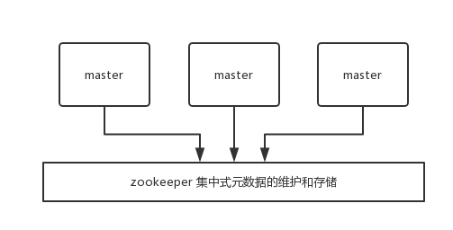
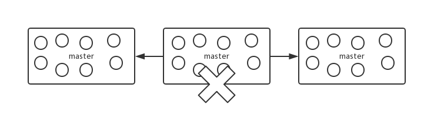
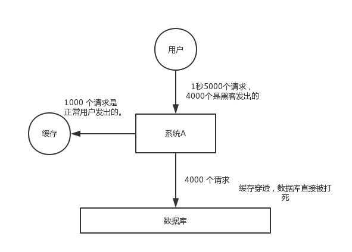

# Redis

## 一 Redis与Mencached的区别

1. Redis支持服务端数据操作，而Mencached需要将数据拿到客户端进行修改后再set回去，这大大增加了网络IO次数和数据体积。
2. 内存合作效率对比：使用简单的key-value存储的话，Mencached的内存利用率更高，而如果Redis使用hash结构来做key-value存储，由于其组合式的压缩，其内存利用率会高于Mencached。
3. 性能对比：由于Redis只使用单核，而Mencached可以使用多核，所以平均每个核上Redis在存储小数据时比Mencached性能更高。而在100k以上的数据中，Mencached性能高于Redis。
4. 【重点】集群模式：Mencached没有原生的集群模式，需要依靠客户端来实现往集群中分片写入数据。Redis支持原生的cluster模式。
5. 【重点】Redis对比Mencached来说，拥有更多的数据结构并支持更丰富的数据操作。


## 二 Redis线程模式

### 1 文件事件处理器

redis基于reactor模式开发了网络事件处理器，这个处理器叫文件事件处理器（file event handler）。这个文件事件处理器采用IO多路利用机制同时监听多个socket，根据socket上的事件来选择对应的事件处理器来处理这个事件。

如果被监听的socket准备好执行accept/read/write/close等操作的时候，跟操作对应的文件事件就会产生，这个时间文件事件处理器就会调用之前关联好的事件处理器来处理这个事件。

文件事件处理器是单线程模式运行的，但是通过IO多路利用机制监听多个socket，可以实现高性能的网络通信模型，又可以跟内部其它单线程的模块进行对接， 保证了redis内部的线程模型的简单性。

文件事件处理器的结构包含 4 个部分：
- 多个 socket
- IO 多路复用程序
- 文件事件分派器
- 事件处理器（连接应答处理器、命令请求处理器、命令回复处理器）

多个socket可能并发的产生不同的操作，每个操作对应不同的文件事件，但是IO多路利用程序会监听多个socket，但是会将socket放入一个队列中排队，每次从队列中取出一个socket给事件分派器，事件分派器把socket给对应的事件处理器。

然后一个socket的事件处理完之后，IO多路复用程序才会将队列中的下一个socket给事件分派器。文件事件分派器会根据每个socket当前产生的事件，来选择对应的事件处理器来处理。

### 2 文件事件

当socket变得可读时（比如客户端对redis执行write操作，或者close操作），或者有新的可以应答的socket出现时（客户端对redis执行connect操作），socket就会产生一个AE_REAADABLE事件。

当socket变得可写的时候（客户端对redis执行read操作），socket会产生一个AE_WRITABLE事件。

IO多路复用程序可以同时监听AE_REABLE和AE_WRITABLE两种事件，要是一个socket同时产生了AE_REABLE和AE_WRITABLE两种事件，那么文件事件分派器优先处理AE_REABLE事件，然后才是AE_WRITABLE事件。

### 3 文件事件处理器

如果客户端要连接redis，那么会为socket关联连接应答处理器
如果是客户端要写数据到redis，那么会为socket关联命令请求处理器
如果是客户端要从redis读数据，那么会为socket关联命令回复处理器


### 4 客户端与redis通信的一次流程


首先，redis 服务端进程初始化的时候，会将 server socket 的 AE_READABLE 事件与连接应答处理器关联。

客户端 socket01 向 redis 进程的 server socket 请求建立连接，此时 server socket 会产生一个 AE_READABLE 事件，IO 多路复用程序监听到 server socket 产生的事件后，将该 socket 压入队列中。文件事件分派器从队列中获取 socket，交给连接应答处理器。连接应答处理器会创建一个能与客户端通信的 socket01，并将该 socket01 的 AE_READABLE 事件与命令请求处理器关联。

假设此时客户端发送了一个 set key value 请求，此时 redis 中的 socket01 会产生 AE_READABLE 事件，IO 多路复用程序将 socket01 压入队列，此时事件分派器从队列中获取到 socket01 产生的 AE_READABLE 事件，由于前面 socket01 的 AE_READABLE 事件已经与命令请求处理器关联，因此事件分派器将事件交给命令请求处理器来处理。命令请求处理器读取 socket01 的 key value 并在自己内存中完成 key value 的设置。操作完成后，它会将 socket01 的 AE_WRITABLE 事件与命令回复处理器关联。

如果此时客户端准备好接收返回结果了，那么 redis 中的 socket01 会产生一个 AE_WRITABLE 事件，同样压入队列中，事件分派器找到相关联的命令回复处理器，由命令回复处理器对 socket01 输入本次操作的一个结果，比如 ok，之后解除 socket01 的 AE_WRITABLE 事件与命令回复处理器的关联。

这样便完成了一次通信。

### 5 为啥 redis 单线程模型也能效率这么高？
- 纯内存操作。
- 核心是基于非阻塞的 IO 多路复用机制。
- C 语言实现，一般来说，C 语言实现的程序“距离”操作系统更近，执行速度相对会更快。
- 单线程反而避免了多线程的频繁上下文切换问题，预防了多线程可能产生的竞争问题。


## 三 redis数据类型


redis 主要有以下几种数据类型：
- string
- hash
- list
- set
- sorted set

### string
这是最简单的类型，就是普通的 set 和 get，做简单的 KV 缓存。
```bash
set college szu
```

### hash
这个是类似 map 的一种结构，这个一般就是可以将结构化的数据，比如一个对象（前提是**这个对象没嵌套其他的对象**）给缓存在 redis 里，然后每次读写缓存的时候，可以就操作 hash 里的**某个字段**。

```bash
hset person name bingo
hset person age 20
hset person id 1
hget person name
```

```json
person = {
    "name": "bingo",
    "age": 20,
    "id": 1
}
```

### list
list 是有序列表，这个可以玩儿出很多花样。

比如可以通过 list 存储一些列表型的数据结构，类似粉丝列表、文章的评论列表之类的东西。

比如可以通过 lrange 命令，读取某个闭区间内的元素，可以基于 list 实现分页查询，这个是很棒的一个功能，基于 redis 实现简单的高性能分页，可以做类似微博那种下拉不断分页的东西，性能高，就一页一页走。
```bash
# 0开始位置，-1结束位置，结束位置为-1时，表示列表的最后一个位置，即查看所有。
lrange mylist 0 -1
```

比如可以搞个简单的消息队列，从 list 头怼进去，从 list 尾巴那里弄出来。
```bash
lpush mylist 1
lpush mylist 2
lpush mylist 3 4 5

# 1
rpop mylist
```

### set
set 是无序集合，自动去重。

直接基于 set 将系统里需要去重的数据扔进去，自动就给去重了，如果你需要对一些数据进行快速的全局去重，你当然也可以基于 jvm 内存里的 HashSet 进行去重，但是如果你的某个系统部署在多台机器上呢？得基于 redis 进行全局的 set 去重。

可以基于 set 玩儿交集、并集、差集的操作，比如交集吧，可以把两个人的粉丝列表整一个交集，看看俩人的共同好友是谁？对吧。

把两个大 V 的粉丝都放在两个 set 中，对两个 set 做交集。
```bash
#-------操作一个set-------
# 添加元素
sadd mySet 1

# 查看全部元素
smembers mySet

# 判断是否包含某个值
sismember mySet 3

# 删除某个/些元素
srem mySet 1
srem mySet 2 4

# 查看元素个数
scard mySet

# 随机删除一个元素
spop mySet

#-------操作多个set-------
# 将一个set的元素移动到另外一个set
smove yourSet mySet 2

# 求两set的交集
sinter yourSet mySet

# 求两set的并集
sunion yourSet mySet

# 求在yourSet中而不在mySet中的元素
sdiff yourSet mySet
```

### sorted set
sorted set 是排序的 set，去重但可以排序，写进去的时候给一个分数，自动根据分数排序。
```bash
zadd board 85 zhangsan
zadd board 72 lisi
zadd board 96 wangwu
zadd board 63 zhaoliu

# 获取排名前三的用户（默认是升序，所以需要 rev 改为降序）
zrevrange board 0 3

# 获取某用户的排名
zrank board zhaoliu
```


## 四 redis 过期策略

1. 定期删除：每100ms随机抽取记录并检查过期时间，如果已过期，将记录删除。

> 如某些记录已过期，但没有被定期删除策略删除的，记录仍会保存在redis中，并占用内存

2. 惰性删除：当客户端通过key查询数据时，redis会先检查一下目标记录是否已经过期，如果已经过期，则将数据删除，并回返空。

3. 内存淘汰：当内存已满，或已不足以容纳新插入的数据时，有如下内存淘汰策略：

- 1）noeviction：当内存不足以容纳新写入数据时，新写入操作会报错，这个一般没人用吧，实在是太恶心了
- 2）allkeys-lru：当内存不足以容纳新写入数据时，在键空间中，移除最近最少使用的key（这个是最常用的）
- 3）allkeys-random：当内存不足以容纳新写入数据时，在键空间中，随机移除某个key，这个一般没人用吧，为啥要随机，肯定是把最近最少使用的key给干掉啊
- 4）volatile-lru：当内存不足以容纳新写入数据时，在设置了过期时间的键空间中，移除最近最少使用的key（这个一般不太合适）
- 5）volatile-random：当内存不足以容纳新写入数据时，在设置了过期时间的键空间中，随机移除某个key
- 6）volatile-ttl：当内存不足以容纳新写入数据时，在设置了过期时间的键空间中，有更早过期时间的key优先移除


## 五 Redis 主从架构

单机的 redis，能够承载的 QPS 大概就在上万到几万不等。对于缓存来说，一般都是用来支撑**读高并发**的。因此架构做成主从(master-slave)架构，一主多从，主负责写，并且将数据复制到其它的 slave 节点，从节点负责读。所有的**读请求全部走从节点**。这样也可以很轻松实现水平扩容，**支撑读高并发**。


redis replication -> 主从架构 -> 读写分离 -> 水平扩容支撑读高并发

### 1 redis replication 的核心机制

- redis 采用**异步方式**复制数据到 slave 节点，不过 redis2.8 开始，slave node 会周期性地确认自己每次复制的数据量；
- 一个 master node 是可以配置多个 slave node 的；
- slave node 也可以连接其他的 slave node；
- slave node 做复制的时候，不会 block master node 的正常工作；
- slave node 在做复制的时候，也不会 block 对自己的查询操作，它会用旧的数据集来提供服务；但是复制完成的时候，需要删除旧数据集，加载新数据集，这个时候就会暂停对外服务了；
- slave node 主要用来进行横向扩容，做读写分离，扩容的 slave node 可以提高读的吞吐量。

注意，如果采用了主从架构，那么建议必须**开启** master node 的[持久化](/docs/high-concurrency/redis-persistence.md)，不建议用 slave node 作为 master node 的数据热备，因为那样的话，如果你关掉 master 的持久化，可能在 master 宕机重启的时候数据是空的，然后可能一经过复制， slave node 的数据也丢了。

另外，master 的各种备份方案，也需要做。万一本地的所有文件丢失了，从备份中挑选一份 rdb 去恢复 master，这样才能**确保启动的时候，是有数据的**，即使采用了后续讲解的[高可用机制](/docs/high-concurrency/redis-sentinel.md)，slave node 可以自动接管 master node，但也可能 sentinel 还没检测到 master failure，master node 就自动重启了，还是可能导致上面所有的 slave node 数据被清空。

### 2 redis 主从复制的核心原理

当启动一个 slave node 的时候，它会发送一个 `PSYNC` 命令给 master node。

如果这是 slave node 初次连接到 master node，那么会触发一次 `full resynchronization` 全量复制。此时 master 会启动一个后台线程，开始生成一份 `RDB` 快照文件，同时还会将从客户端 client 新收到的所有写命令缓存在内存中。`RDB` 文件生成完毕后， master 会将这个 `RDB` 发送给 slave，slave 会先**写入本地磁盘，然后再从本地磁盘加载到内存**中，接着 master 会将内存中缓存的写命令发送到 slave，slave 也会同步这些数据。slave node 如果跟 master node 有网络故障，断开了连接，会自动重连，连接之后 master node 仅会复制给 slave 部分缺少的数据。


#### 2.1 主从复制的断点续传
从 redis2.8 开始，就支持主从复制的断点续传，如果主从复制过程中，网络连接断掉了，那么可以接着上次复制的地方，继续复制下去，而不是从头开始复制一份。

master node 会在内存中维护一个 backlog，master 和 slave 都会保存一个 replica offset 还有一个 master run id，offset 就是保存在 backlog 中的。如果 master 和 slave 网络连接断掉了，slave 会让 master 从上次 replica offset 开始继续复制，如果没有找到对应的 offset，那么就会执行一次 `resynchronization`。

> 如果根据 host+ip 定位 master node，是不靠谱的，如果 master node 重启或者数据出现了变化，那么 slave node 应该根据不同的 run id 区分。

#### 2.2 无磁盘化复制
master 在内存中直接创建 `RDB`，然后发送给 slave，不会在自己本地落地磁盘了。只需要在配置文件中开启 `repl-diskless-sync yes` 即可。
```bash
repl-diskless-sync yes

# 等待 5s 后再开始复制，因为要等更多 slave 重新连接过来
repl-diskless-sync-delay 5
```

#### 2.3 过期 key 处理
slave 不会过期 key，只会等待 master 过期 key。如果 master 过期了一个 key，或者通过 LRU 淘汰了一个 key，那么会模拟一条 del 命令发送给 slave。

### 3 复制的完整流程
slave node 启动时，会在自己本地保存 master node 的信息，包括 master node 的`host`和`ip`，但是复制流程没开始。

slave node 内部有个定时任务，每秒检查是否有新的 master node 要连接和复制，如果发现，就跟 master node 建立 socket 网络连接。然后 slave node 发送 `ping` 命令给 master node。如果 master 设置了 requirepass，那么 slave node 必须发送 masterauth 的口令过去进行认证。master node **第一次执行全量复制**，将所有数据发给 slave node。而在后续，master node 持续将写命令，异步复制给 slave node。

  


#### 3.1 全量复制
- master 执行 bgsave ，在本地生成一份 rdb 快照文件。
- master node 将 rdb 快照文件发送给 slave node，如果 rdb 复制时间超过 60秒（repl-timeout），那么 slave node 就会认为复制失败，可以适当调大这个参数(对于千兆网卡的机器，一般每秒传输 100MB，6G 文件，很可能超过 60s)
- master node 在生成 rdb 时，会将所有新的写命令缓存在内存中，在 slave node 保存了 rdb 之后，再将新的写命令复制给 slave node。
- 如果在复制期间，内存缓冲区持续消耗超过 64MB，或者一次性超过 256MB，那么停止复制，复制失败。
```bash
client-output-buffer-limit slave 256MB 64MB 60
```
- slave node 接收到 rdb 之后，清空自己的旧数据，然后重新加载 rdb 到自己的内存中，同时**基于旧的数据版本**对外提供服务。
- 如果 slave node 开启了 AOF，那么会立即执行 BGREWRITEAOF，重写 AOF。

#### 3.2 增量复制
- 如果全量复制过程中，master-slave 网络连接断掉，那么 slave 重新连接 master 时，会触发增量复制。
- master 直接从自己的 backlog 中获取部分丢失的数据，发送给 slave node，默认 backlog 就是 1MB。
- master 就是根据 slave 发送的 psync 中的 offset 来从 backlog 中获取数据的。

#### 3.3 heartbeat
主从节点互相都会发送 heartbeat 信息。

master 默认每隔 10秒 发送一次 heartbeat，slave node 每隔 1秒 发送一个 heartbeat。

#### 3.4 异步复制
master 每次接收到写命令之后，先在内部写入数据，然后异步发送给 slave node。

### 4 redis 如何才能做到高可用
如果系统在 365 天内，有 99.99% 的时间，都是可以哗哗对外提供服务的，那么就说系统是高可用的。

一个 slave 挂掉了，是不会影响可用性的，还有其它的 slave 在提供相同数据下的相同的对外的查询服务。

但是，如果 master node 死掉了，会怎么样？没法写数据了，写缓存的时候，全部失效了。slave node 还有什么用呢，没有 master 给它们复制数据了，系统相当于不可用了。

redis 的高可用架构，叫做 `failover` **故障转移**，也可以叫做主备切换。

master node 在故障时，自动检测，并且将某个 slave node 自动切换为 master node 的过程，叫做主备切换。这个过程，实现了 redis 的主从架构下的高可用。


## 六 Redis 哨兵集群实现高可用

### 6.1 哨兵的介绍
sentinel，中文名是哨兵。哨兵是 redis 集群机构中非常重要的一个组件，主要有以下功能：

- 集群监控：负责监控 redis master 和 slave 进程是否正常工作。
- 消息通知：如果某个 redis 实例有故障，那么哨兵负责发送消息作为报警通知给管理员。
- 故障转移：如果 master node 挂掉了，会自动转移到 slave node 上。
- 配置中心：如果故障转移发生了，通知 client 客户端新的 master 地址。

哨兵用于实现 redis 集群的高可用，本身也是分布式的，作为一个哨兵集群去运行，互相协同工作。

- 故障转移时，判断一个 master node 是否宕机了，需要大部分的哨兵都同意才行，涉及到了分布式选举的问题。
- 即使部分哨兵节点挂掉了，哨兵集群还是能正常工作的，因为如果一个作为高可用机制重要组成部分的故障转移系统本身是单点的，那就很坑爹了。

### 6.2 哨兵的核心知识
- 哨兵至少需要 3 个实例，来保证自己的健壮性。
- 哨兵 + redis 主从的部署架构，是**不保证数据零丢失**的，只能保证 redis 集群的高可用性。
- 对于哨兵 + redis 主从这种复杂的部署架构，尽量在测试环境和生产环境，都进行充足的测试和演练。

哨兵集群必须部署 2 个以上节点，如果哨兵集群仅仅部署了 2 个哨兵实例，quorum = 1。

```
+----+         +----+
| M1 |---------| R1 |
| S1 |         | S2 |
+----+         +----+
```

配置 `quorum=1`，如果 master 宕机， s1 和 s2 中只要有 1 个哨兵认为 master 宕机了，就可以进行切换，同时 s1 和 s2 会选举出一个哨兵来执行故障转移。但是同时这个时候，需要 majority，也就是大多数哨兵都是运行的。

```
2 个哨兵，majority=2
3 个哨兵，majority=2
4 个哨兵，majority=2
5 个哨兵，majority=3
...
```

如果此时仅仅是 M1 进程宕机了，哨兵 s1 正常运行，那么故障转移是 OK 的。但是如果是整个 M1 和 S1 运行的机器宕机了，那么哨兵只有 1 个，此时就没有 majority 来允许执行故障转移，虽然另外一台机器上还有一个 R1，但是故障转移不会执行。

经典的 3 节点哨兵集群是这样的：

```
       +----+
       | M1 |
       | S1 |
       +----+
          |
+----+    |    +----+
| R2 |----+----| R3 |
| S2 |         | S3 |
+----+         +----+
```

配置 `quorum=2`，如果 M1 所在机器宕机了，那么三个哨兵还剩下 2 个，S2 和 S3 可以一致认为 master 宕机了，然后选举出一个来执行故障转移，同时 3 个哨兵的 majority 是 2，所以还剩下的 2 个哨兵运行着，就可以允许执行故障转移。

### 6.3 redis 哨兵主备切换的数据丢失问题
#### 6.3.1 两种情况和导致数据丢失
主备切换的过程，可能会导致数据丢失：

- 异步复制导致的数据丢失

因为 master->slave 的复制是异步的，所以可能有部分数据还没复制到 slave，master 就宕机了，此时这部分数据就丢失了。


- 脑裂导致的数据丢失

脑裂，也就是说，某个 master 所在机器突然**脱离了正常的网络**，跟其他 slave 机器不能连接，但是实际上 master 还运行着。此时哨兵可能就会**认为** master 宕机了，然后开启选举，将其他 slave 切换成了 master。这个时候，集群里就会有两个 master ，也就是所谓的**脑裂**。

此时虽然某个 slave 被切换成了 master，但是可能 client 还没来得及切换到新的 master，还继续向旧 master 写数据。因此旧 master 再次恢复的时候，会被作为一个 slave 挂到新的 master 上去，自己的数据会清空，重新从新的 master 复制数据。而新的 master 并没有后来 client 写入的数据，因此，这部分数据也就丢失了。


#### 6.3.2 数据丢失问题的解决方案
进行如下配置：

```bash
min-slaves-to-write 1
min-slaves-max-lag 10
```

表示，要求至少有 1 个 slave，数据复制和同步的延迟不能超过 10 秒。

如果说一旦所有的 slave，数据复制和同步的延迟都超过了 10 秒钟，那么这个时候，master 就不会再接收任何请求了。

- 减少异步复制数据的丢失

有了 `min-slaves-max-lag` 这个配置，就可以确保说，一旦 slave 复制数据和 ack 延时太长，就认为可能 master 宕机后损失的数据太多了，那么就拒绝写请求，这样可以把 master 宕机时由于部分数据未同步到 slave 导致的数据丢失降低的可控范围内。

- 减少脑裂的数据丢失

如果一个 master 出现了脑裂，跟其他 slave 丢了连接，那么上面两个配置可以确保说，如果不能继续给指定数量的 slave 发送数据，而且 slave 超过 10 秒没有给自己 ack 消息，那么就直接拒绝客户端的写请求。因此在脑裂场景下，最多就丢失 10 秒的数据。

### 6.4 sdown 和 odown 转换机制
- sdown 是主观宕机，就一个哨兵如果自己觉得一个 master 宕机了，那么就是主观宕机
- odown 是客观宕机，如果 quorum 数量的哨兵都觉得一个 master 宕机了，那么就是客观宕机

sdown 达成的条件很简单，如果一个哨兵 ping 一个 master，超过了 `is-master-down-after-milliseconds` 指定的毫秒数之后，就主观认为 master 宕机了；如果一个哨兵在指定时间内，收到了 quorum 数量的其它哨兵也认为那个 master 是 sdown 的，那么就认为是 odown 了。

### 6.5 哨兵集群的自动发现机制
哨兵互相之间的发现，是通过 redis 的 `pub/sub` 系统实现的，每个哨兵都会往 `__sentinel__:hello` 这个 channel 里发送一个消息，这时候所有其他哨兵都可以消费到这个消息，并感知到其他的哨兵的存在。

每隔两秒钟，每个哨兵都会往自己监控的某个 master+slaves 对应的 `__sentinel__:hello` channel 里**发送一个消息**，内容是自己的 host、ip 和 runid 还有对这个 master 的监控配置。

每个哨兵也会去**监听**自己监控的每个 master+slaves 对应的 `__sentinel__:hello` channel，然后去感知到同样在监听这个 master+slaves 的其他哨兵的存在。

每个哨兵还会跟其他哨兵交换对 `master` 的监控配置，互相进行监控配置的同步。

### 6.6 slave 配置的自动纠正
哨兵会负责自动纠正 slave 的一些配置，比如 slave 如果要成为潜在的 master 候选人，哨兵会确保 slave 复制现有 master 的数据；如果 slave 连接到了一个错误的 master 上，比如故障转移之后，那么哨兵会确保它们连接到正确的 master 上。

### 6.7 slave->master 选举算法
如果一个 master 被认为 odown 了，而且 majority 数量的哨兵都允许主备切换，那么某个哨兵就会执行主备切换操作，此时首先要选举一个 slave 来，会考虑 slave 的一些信息：

- 跟 master 断开连接的时长
- slave 优先级
- 复制 offset
- run id

如果一个 slave 跟 master 断开连接的时间已经超过了 `down-after-milliseconds` 的 10 倍，外加 master 宕机的时长，那么 slave 就被认为不适合选举为 master。

```
(down-after-milliseconds * 10) + milliseconds_since_master_is_in_SDOWN_state
```

接下来会对 slave 进行排序：

- 按照 slave 优先级进行排序，slave priority 越低，优先级就越高。
- 如果 slave priority 相同，那么看 replica offset，哪个 slave 复制了越多的数据，offset 越靠后，优先级就越高。
- 如果上面两个条件都相同，那么选择一个 run id 比较小的那个 slave。

### 6.8 quorum 和 majority
每次一个哨兵要做主备切换，首先需要 quorum 数量的哨兵认为 odown，然后选举出一个哨兵来做切换，这个哨兵还需要得到 majority 哨兵的授权，才能正式执行切换。

如果 quorum < majority，比如 5 个哨兵，majority 就是 3，quorum 设置为 2，那么就 3 个哨兵授权就可以执行切换。

但是如果 quorum >= majority，那么必须 quorum 数量的哨兵都授权，比如 5 个哨兵，quorum 是 5，那么必须 5 个哨兵都同意授权，才能执行切换。

### 6.9 configuration epoch
哨兵会对一套 redis master+slaves 进行监控，有相应的监控的配置。

执行切换的那个哨兵，会从要切换到的新 master（salve->master）那里得到一个 configuration epoch，这就是一个 version 号，每次切换的 version 号都必须是唯一的。

如果第一个选举出的哨兵切换失败了，那么其他哨兵，会等待 failover-timeout 时间，然后接替继续执行切换，此时会重新获取一个新的 configuration epoch，作为新的 version 号。

### 6.10 configuration 传播
哨兵完成切换之后，会在自己本地更新生成最新的 master 配置，然后同步给其他的哨兵，就是通过之前说的 `pub/sub` 消息机制。

这里之前的 version 号就很重要了，因为各种消息都是通过一个 channel 去发布和监听的，所以一个哨兵完成一次新的切换之后，新的 master 配置是跟着新的 version 号的。其他的哨兵都是根据版本号的大小来更新自己的 master 配置的。


## 七 Redis 持久化


持久化主要是做灾难恢复、数据恢复，也可以归类到高可用的一个环节中去，比如你 redis 整个挂了，然后 redis 就不可用了，你要做的事情就是让 redis 变得可用，尽快变得可用。

重启 redis，尽快让它对外提供服务，如果没做数据备份，这时候 redis 启动了，也不可用啊，数据都没了。

很可能说，大量的请求过来，缓存全部无法命中，在 redis 里根本找不到数据，这个时候就死定了，出现**缓存雪崩**问题。所有请求没有在 redis 命中，就会去 mysql 数据库这种数据源头中去找，一下子 mysql 承接高并发，然后就挂了...

如果你把 redis 持久化做好，备份和恢复方案做到企业级的程度，那么即使你的 redis 故障了，也可以通过备份数据，快速恢复，一旦恢复立即对外提供服务。

### 7.1 redis 持久化的两种方式
- RDB：RDB 持久化机制，是对 redis 中的数据执行**周期性**的持久化。
- AOF：AOF 机制对每条写入命令作为日志，以 `append-only` 的模式写入一个日志文件中，在 redis 重启的时候，可以通过**回放** AOF 日志中的写入指令来重新构建整个数据集。

通过 RDB 或 AOF，都可以将 redis 内存中的数据给持久化到磁盘上面来，然后可以将这些数据备份到别的地方去，比如说阿里云等云服务。

如果 redis 挂了，服务器上的内存和磁盘上的数据都丢了，可以从云服务上拷贝回来之前的数据，放到指定的目录中，然后重新启动 redis，redis 就会自动根据持久化数据文件中的数据，去恢复内存中的数据，继续对外提供服务。

如果同时使用 RDB 和 AOF 两种持久化机制，那么在 redis 重启的时候，会使用 **AOF** 来重新构建数据，因为 AOF 中的**数据更加完整**。

#### 7.1.1 RDB 优缺点
- RDB 会生成多个数据文件，每个数据文件都代表了某一个时刻中 redis 的数据，这种多个数据文件的方式，**非常适合做冷备**，可以将这种完整的数据文件发送到一些远程的安全存储上去，比如说 Amazon 的 S3 云服务上去，在国内可以是阿里云的 ODPS 分布式存储上，以预定好的备份策略来定期备份 redis 中的数据。
- RDB 对 redis 对外提供的读写服务，影响非常小，可以让 redis **保持高性能**，因为 redis 主进程只需要 fork 一个子进程，让子进程执行磁盘 IO 操作来进行 RDB 持久化即可。
- 相对于 AOF 持久化机制来说，直接基于 RDB 数据文件来重启和恢复 redis 进程，更加快速。

- 如果想要在 redis 故障时，尽可能少的丢失数据，那么 RDB 没有 AOF 好。一般来说，RDB 数据快照文件，都是每隔 5 分钟，或者更长时间生成一次，这个时候就得接受一旦 redis 进程宕机，那么会丢失最近 5 分钟的数据。
- RDB 每次在 fork 子进程来执行 RDB 快照数据文件生成的时候，如果数据文件特别大，可能会导致对客户端提供的服务暂停数毫秒，或者甚至数秒。

#### 7.1.2 AOF 优缺点
- AOF 可以更好的保护数据不丢失，一般 AOF 会每隔 1 秒，通过一个后台线程执行一次`fsync`操作，最多丢失 1 秒钟的数据。
- AOF 日志文件以 `append-only` 模式写入，所以没有任何磁盘寻址的开销，写入性能非常高，而且文件不容易破损，即使文件尾部破损，也很容易修复。
- AOF 日志文件即使过大的时候，出现后台重写操作，也不会影响客户端的读写。因为在 `rewrite` log 的时候，会对其中的指令进行压缩，创建出一份需要恢复数据的最小日志出来。在创建新日志文件的时候，老的日志文件还是照常写入。当新的 merge 后的日志文件 ready 的时候，再交换新老日志文件即可。
- AOF 日志文件的命令通过非常可读的方式进行记录，这个特性非常**适合做灾难性的误删除的紧急恢复**。比如某人不小心用 `flushall` 命令清空了所有数据，只要这个时候后台 `rewrite` 还没有发生，那么就可以立即拷贝 AOF 文件，将最后一条 `flushall` 命令给删了，然后再将该 `AOF` 文件放回去，就可以通过恢复机制，自动恢复所有数据。
- 对于同一份数据来说，AOF 日志文件通常比 RDB 数据快照文件更大。
- AOF 开启后，支持的写 QPS 会比 RDB 支持的写 QPS 低，因为 AOF 一般会配置成每秒 `fsync` 一次日志文件，当然，每秒一次 `fsync`，性能也还是很高的。（如果实时写入，那么 QPS 会大降，redis 性能会大大降低）
- 以前 AOF 发生过 bug，就是通过 AOF 记录的日志，进行数据恢复的时候，没有恢复一模一样的数据出来。所以说，类似 AOF 这种较为复杂的基于命令日志 / merge / 回放的方式，比基于 RDB 每次持久化一份完整的数据快照文件的方式，更加脆弱一些，容易有 bug。不过 AOF 就是为了避免 rewrite 过程导致的 bug，因此每次 rewrite 并不是基于旧的指令日志进行 merge 的，而是**基于当时内存中的数据进行指令的重新构建**，这样健壮性会好很多。

### 7.2 RDB 和 AOF 到底该如何选择
- 不要仅仅使用 RDB，因为那样会导致你丢失很多数据；
- 也不要仅仅使用 AOF，因为那样有两个问题：第一，你通过 AOF 做冷备，没有 RDB 做冷备来的恢复速度更快；第二，RDB 每次简单粗暴生成数据快照，更加健壮，可以避免 AOF 这种复杂的备份和恢复机制的 bug；
- redis 支持同时开启开启两种持久化方式，我们可以综合使用 AOF 和 RDB 两种持久化机制，用 AOF 来保证数据不丢失，作为数据恢复的第一选择; 用 RDB 来做不同程度的冷备，在 AOF 文件都丢失或损坏不可用的时候，还可以使用 RDB 来进行快速的数据恢复。


## 八 Redis-Cluster

> redis 集群模式的工作原理能说一下么？在集群模式下，redis 的 key 是如何寻址的？分布式寻址都有哪些算法？了解一致性 hash 算法吗？

在前几年，redis 如果要搞几个节点，每个节点存储一部分的数据，得**借助一些中间件**来实现，比如说有 `codis`，或者 `twemproxy`，都有。有一些 redis 中间件，你读写 redis 中间件，redis 中间件负责将你的数据分布式存储在多台机器上的 redis 实例中。

这两年，redis 不断在发展，redis 也不断有新的版本，现在的 redis 集群模式，可以做到在多台机器上，部署多个 redis 实例，每个实例存储一部分的数据，同时每个 redis 主实例可以挂 redis 从实例，自动确保说，如果 redis 主实例挂了，会自动切换到 redis 从实例上来。

现在 redis 的新版本，大家都是用 redis cluster 的，也就是 redis 原生支持的 redis 集群模式，那么面试官肯定会就 redis cluster 对你来个几连炮。要是你没用过 redis cluster，正常，以前很多人用 codis 之类的客户端来支持集群，但是起码你得研究一下 redis cluster 吧。

如果你的数据量很少，主要是承载高并发高性能的场景，比如你的缓存一般就几个 G，单机就足够了，可以使用 replication，一个 master 多个 slaves，要几个 slave 跟你要求的读吞吐量有关，然后自己搭建一个 sentinel 集群去保证 redis 主从架构的高可用性。

redis cluster，主要是针对**海量数据+高并发+高可用**的场景。redis cluster 支撑 N 个 redis master node，每个 master node 都可以挂载多个 slave node。这样整个 redis 就可以横向扩容了。如果你要支撑更大数据量的缓存，那就横向扩容更多的 master 节点，每个 master 节点就能存放更多的数据了。


### 1 redis cluster 介绍
- 自动将数据进行分片，每个 master 上放一部分数据
- 提供内置的高可用支持，部分 master 不可用时，还是可以继续工作的

在 redis cluster 架构下，每个 redis 要放开两个端口号，比如一个是 6379，另外一个就是 加1w 的端口号，比如 16379。

16379 端口号是用来进行节点间通信的，也就是 cluster bus 的东西，cluster bus 的通信，用来进行故障检测、配置更新、故障转移授权。cluster bus 用了另外一种二进制的协议，`gossip` 协议，用于节点间进行高效的数据交换，占用更少的网络带宽和处理时间。

### 2 节点间的内部通信机制
#### 基本通信原理
集群元数据的维护有两种方式：集中式、Gossip 协议。redis cluster 节点间采用 gossip 协议进行通信。

**集中式**是将集群元数据（节点信息、故障等等）几种存储在某个节点上。集中式元数据集中存储的一个典型代表，就是大数据领域的 `storm`。它是分布式的大数据实时计算引擎，是集中式的元数据存储的结构，底层基于 zookeeper（分布式协调的中间件）对所有元数据进行存储维护。



redis 维护集群元数据采用另一个方式， `gossip` 协议，所有节点都持有一份元数据，不同的节点如果出现了元数据的变更，就不断将元数据发送给其它的节点，让其它节点也进行元数据的变更。


**集中式**的**好处**在于，元数据的读取和更新，时效性非常好，一旦元数据出现了变更，就立即更新到集中式的存储中，其它节点读取的时候就可以感知到；**不好**在于，所有的元数据的更新压力全部集中在一个地方，可能会导致元数据的存储有压力。

gossip 好处在于，元数据的更新比较分散，不是集中在一个地方，更新请求会陆陆续续打到所有节点上去更新，降低了压力；不好在于，元数据的更新有延时，可能导致集群中的一些操作会有一些滞后。

- 10000 端口：每个节点都有一个专门用于节点间通信的端口，就是自己提供服务的端口号+10000，比如 7001，那么用于节点间通信的就是 17001 端口。每个节点每隔一段时间都会往另外几个节点发送 `ping` 消息，同时其它几个节点接收到 `ping` 之后返回 `pong`。

- 交换的信息：信息包括故障信息，节点的增加和删除，hash slot 信息等等。

#### gossip 协议
gossip 协议包含多种消息，包含 `ping`,`pong`,`meet`,`fail` 等等。

- meet：某个节点发送 meet 给新加入的节点，让新节点加入集群中，然后新节点就会开始与其它节点进行通信。

```bash
redis-trib.rb add-node
```

其实内部就是发送了一个 gossip meet 消息给新加入的节点，通知那个节点去加入我们的集群。

- ping：每个节点都会频繁给其它节点发送 ping，其中包含自己的状态还有自己维护的集群元数据，互相通过 ping 交换元数据。
- pong：返回 ping 和 meeet，包含自己的状态和其它信息，也用于信息广播和更新。
- fail：某个节点判断另一个节点 fail 之后，就发送 fail 给其它节点，通知其它节点说，某个节点宕机啦。

#### ping 消息深入
ping 时要携带一些元数据，如果很频繁，可能会加重网络负担。

每个节点每秒会执行 10 次 ping，每次会选择 5 个最久没有通信的其它节点。当然如果发现某个节点通信延时达到了 `cluster_node_timeout / 2`，那么立即发送 ping，避免数据交换延时过长，落后的时间太长了。比如说，两个节点之间都 10 分钟没有交换数据了，那么整个集群处于严重的元数据不一致的情况，就会有问题。所以 `cluster_node_timeout` 可以调节，如果调得比较大，那么会降低 ping 的频率。

每次 ping，会带上自己节点的信息，还有就是带上 1/10 其它节点的信息，发送出去，进行交换。至少包含 `3` 个其它节点的信息，最多包含 `总节点数减 2` 个其它节点的信息。

### 3 分布式寻址算法
- hash 算法（大量缓存重建）
- 一致性 hash 算法（自动缓存迁移）+ 虚拟节点（自动负载均衡）
- redis cluster 的 hash slot 算法

#### hash 算法
来了一个 key，首先计算 hash 值，然后对节点数取模。然后打在不同的 master 节点上。一旦某一个 master 节点宕机，所有请求过来，都会基于最新的剩余 master 节点数去取模，尝试去取数据。这会导致**大部分的请求过来，全部无法拿到有效的缓存**，导致大量的流量涌入数据库。


#### 一致性 hash 算法
一致性 hash 算法将整个 hash 值空间组织成一个虚拟的圆环，整个空间按顺时针方向组织，下一步将各个 master 节点（使用服务器的 ip 或主机名）进行 hash。这样就能确定每个节点在其哈希环上的位置。

来了一个 key，首先计算 hash 值，并确定此数据在环上的位置，从此位置沿环**顺时针“行走”**，遇到的第一个 master 节点就是 key 所在位置。

在一致性哈希算法中，如果一个节点挂了，受影响的数据仅仅是此节点到环空间前一个节点（沿着逆时针方向行走遇到的第一个节点）之间的数据，其它不受影响。增加一个节点也同理。

燃鹅，一致性哈希算法在节点太少时，容易因为节点分布不均匀而造成**缓存热点**的问题。为了解决这种热点问题，一致性 hash 算法引入了虚拟节点机制，即对每一个节点计算多个 hash，每个计算结果位置都放置一个虚拟节点。这样就实现了数据的均匀分布，负载均衡。


#### redis cluster 的 hash slot 算法
redis cluster 有固定的 `16384` 个 hash slot，对每个 `key` 计算 `CRC16` 值，然后对 `16384` 取模，可以获取 key 对应的 hash slot。

redis cluster 中每个 master 都会持有部分 slot，比如有 3 个 master，那么可能每个 master 持有 5000 多个 hash slot。hash slot 让 node 的增加和移除很简单，增加一个 master，就将其他 master 的 hash slot 移动部分过去，减少一个 master，就将它的 hash slot 移动到其他 master 上去。移动 hash slot 的成本是非常低的。客户端的 api，可以对指定的数据，让他们走同一个 hash slot，通过 `hash tag` 来实现。

任何一台机器宕机，另外两个节点，不影响的。因为 key 找的是 hash slot，不是机器。



### 4 redis cluster 的高可用与主备切换原理
redis cluster 的高可用的原理，几乎跟哨兵是类似的。

#### 判断节点宕机
如果一个节点认为另外一个节点宕机，那么就是 `pfail`，**主观宕机**。如果多个节点都认为另外一个节点宕机了，那么就是 `fail`，**客观宕机**，跟哨兵的原理几乎一样，sdown，odown。

在 `cluster-node-timeout` 内，某个节点一直没有返回 `pong`，那么就被认为 `pfail`。

如果一个节点认为某个节点 `pfail` 了，那么会在 `gossip ping` 消息中，`ping` 给其他节点，如果**超过半数**的节点都认为 `pfail` 了，那么就会变成 `fail`。

#### 从节点过滤
对宕机的 master node，从其所有的 slave node 中，选择一个切换成 master node。

检查每个 slave node 与 master node 断开连接的时间，如果超过了 `cluster-node-timeout * cluster-slave-validity-factor`，那么就**没有资格**切换成 `master`。

#### 从节点选举
每个从节点，都根据自己对 master 复制数据的 offset，来设置一个选举时间，offset 越大（复制数据越多）的从节点，选举时间越靠前，优先进行选举。

所有的 master node 开始 slave 选举投票，给要进行选举的 slave 进行投票，如果大部分 master node`（N/2 + 1）`都投票给了某个从节点，那么选举通过，那个从节点可以切换成 master。

从节点执行主备切换，从节点切换为主节点。

#### 与哨兵比较
整个流程跟哨兵相比，非常类似，所以说，redis cluster 功能强大，直接集成了 replication 和 sentinel 的功能。


## 九 了解什么是 redis 的雪崩、穿透和击穿？Redis 崩溃之后会怎么样？系统该如何应对这种情况？如何处理 Redis 的穿透？


>了解什么是 redis 的雪崩、穿透和击穿？redis 崩溃之后会怎么样？系统该如何应对这种情况？如何处理 redis 的穿透？
>其实这是问到缓存必问的，因为缓存雪崩和穿透，是缓存最大的两个问题，要么不出现，一旦出现就是致命性的问题，所以面试官一定会问你。


### 1 缓存雪崩
对于系统 A，假设每天高峰期每秒 5000 个请求，本来缓存在高峰期可以扛住每秒 4000 个请求，但是缓存机器意外发生了全盘宕机。缓存挂了，此时 1 秒 5000 个请求全部落数据库，数据库必然扛不住，它会报一下警，然后就挂了。此时，如果没有采用什么特别的方案来处理这个故障，DBA 很着急，重启数据库，但是数据库立马又被新的流量给打死了。

这就是缓存雪崩。


大约在 3 年前，国内比较知名的一个互联网公司，曾因为缓存事故，导致雪崩，后台系统全部崩溃，事故从当天下午持续到晚上凌晨 3~4 点，公司损失了几千万。

缓存雪崩的事前事中事后的解决方案如下。
- 事前：redis 高可用，主从+哨兵，redis cluster，避免全盘崩溃。
- 事中：本地 ehcache 缓存 + hystrix 限流&降级，避免 MySQL 被打死。
- 事后：redis 持久化，一旦重启，自动从磁盘上加载数据，快速恢复缓存数据。


用户发送一个请求，系统 A 收到请求后，先查本地 ehcache 缓存，如果没查到再查 redis。如果 ehcache 和 redis 都没有，再查数据库，将数据库中的结果，写入 ehcache 和 redis 中。

限流组件，可以设置每秒的请求，有多少能通过组件，剩余的未通过的请求，怎么办？**走降级**！可以返回一些默认的值，或者友情提示，或者空白的值。

好处：
- 数据库绝对不会死，限流组件确保了每秒只有多少个请求能通过。
- 只要数据库不死，就是说，对用户来说，2/5 的请求都是可以被处理的。
- 只要有 2/5 的请求可以被处理，就意味着你的系统没死，对用户来说，可能就是点击几次刷不出来页面，但是多点几次，就可以刷出来一次。

### 2 缓存穿透
对于系统A，假设一秒 5000 个请求，结果其中 4000 个请求是黑客发出的恶意攻击。

黑客发出的那 4000 个攻击，缓存中查不到，每次你去数据库里查，也查不到。

举个栗子。数据库 id 是从 1 开始的，结果黑客发过来的请求 id 全部都是负数。这样的话，缓存中不会有，请求每次都“**视缓存于无物**”，直接查询数据库。这种恶意攻击场景的缓存穿透就会直接把数据库给打死。



解决方式很简单，每次系统 A 从数据库中只要没查到，就写一个空值到缓存里去，比如 `set -999 UNKNOWN`。然后设置一个过期时间，这样的话，下次有相同的 key 来访问的时候，在缓存失效之前，都可以直接从缓存中取数据。

### 3 缓存击穿
缓存击穿，就是说某个 key 非常热点，访问非常频繁，处于集中式高并发访问的情况，当这个 key 在失效的瞬间，大量的请求就击穿了缓存，直接请求数据库，就像是在一道屏障上凿开了一个洞。

解决方式也很简单，可以将热点数据设置为永远不过期；或者基于 redis or zookeeper 实现互斥锁，等待第一个请求构建完缓存之后，再释放锁，进而其它请求才能通过该 key 访问数据。


## 十 如何保证缓存与数据库的双写一致性？


>如何保证缓存与数据库的双写一致性？

>你只要用缓存，就可能会涉及到缓存与数据库双存储双写，你只要是双写，就一定会有数据一致性的问题，那么你如何解决一致性问题？


一般来说，如果允许缓存可以稍微的跟数据库偶尔有不一致的情况，也就是说如果你的系统**不是严格要求** “缓存+数据库” 必须保持一致性的话，最好不要做这个方案，即：**读请求和写请求串行化**，串到一个**内存队列**里去。

串行化可以保证一定不会出现不一致的情况，但是它也会导致系统的吞吐量大幅度降低，用比正常情况下多几倍的机器去支撑线上的一个请求。

### Cache Aside Pattern

最经典的缓存+数据库读写的模式，就是 Cache Aside Pattern。
- 读的时候，先读缓存，缓存没有的话，就读数据库，然后取出数据后放入缓存，同时返回响应。
- 更新的时候，**先更新数据库，然后再删除缓存**。

**为什么是删除缓存，而不是更新缓存？**

原因很简单，很多时候，在复杂点的缓存场景，缓存不单单是数据库中直接取出来的值。

比如可能更新了某个表的一个字段，然后其对应的缓存，是需要查询另外两个表的数据并进行运算，才能计算出缓存最新的值的。

另外更新缓存的代价有时候是很高的。是不是说，每次修改数据库的时候，都一定要将其对应的缓存更新一份？也许有的场景是这样，但是对于**比较复杂的缓存数据计算的场景**，就不是这样了。如果你频繁修改一个缓存涉及的多个表，缓存也频繁更新。但是问题在于，**这个缓存到底会不会被频繁访问到？**

举个栗子，一个缓存涉及的表的字段，在 1 分钟内就修改了 20 次，或者是 100 次，那么缓存更新 20 次、100 次；但是这个缓存在 1 分钟内只被读取了 1 次，有**大量的冷数据**。实际上，如果你只是删除缓存的话，那么在 1 分钟内，这个缓存不过就重新计算一次而已，开销大幅度降低。**用到缓存才去算缓存。**

其实删除缓存，而不是更新缓存，就是一个 lazy 计算的思想，不要每次都重新做复杂的计算，不管它会不会用到，而是让它到需要被使用的时候再重新计算。像 mybatis，hibernate，都有懒加载思想。查询一个部门，部门带了一个员工的 list，没有必要说每次查询部门，都里面的 1000 个员工的数据也同时查出来啊。80% 的情况，查这个部门，就只是要访问这个部门的信息就可以了。先查部门，同时要访问里面的员工，那么这个时候只有在你要访问里面的员工的时候，才会去数据库里面查询 1000 个员工。

### 最初级的缓存不一致问题及解决方案
问题：先更新数据库，再删除缓存。如果删除缓存失败了，那么会导致数据库中是新数据，缓存中是旧数据，数据就出现了不一致。


解决思路：先删除缓存，再更新数据库。如果数据库更新失败了，那么数据库中是旧数据，缓存中是空的，那么数据不会不一致。因为读的时候缓存没有，所以去读了数据库中的旧数据，然后更新到缓存中。

### 比较复杂的数据不一致问题分析
数据发生了变更，先删除了缓存，然后要去修改数据库，此时还没修改。一个请求过来，去读缓存，发现缓存空了，去查询数据库，**查到了修改前的旧数据**，放到了缓存中。随后数据变更的程序完成了数据库的修改。完了，数据库和缓存中的数据不一样了...

**为什么上亿流量高并发场景下，缓存会出现这个问题？**

只有在对一个数据在并发的进行读写的时候，才可能会出现这种问题。其实如果说你的并发量很低的话，特别是读并发很低，每天访问量就 1 万次，那么很少的情况下，会出现刚才描述的那种不一致的场景。但是问题是，如果每天的是上亿的流量，每秒并发读是几万，每秒只要有数据更新的请求，就**可能会出现上述的数据库+缓存不一致的情况**。

**解决方案如下：**

更新数据的时候，根据**数据的唯一标识**，将操作路由之后，发送到一个 jvm 内部队列中。读取数据的时候，如果发现数据不在缓存中，那么将重新读取数据+更新缓存的操作，根据唯一标识路由之后，也发送同一个 jvm 内部队列中。

一个队列对应一个工作线程，每个工作线程**串行**拿到对应的操作，然后一条一条的执行。这样的话，一个数据变更的操作，先删除缓存，然后再去更新数据库，但是还没完成更新。此时如果一个读请求过来，没有读到缓存，那么可以先将缓存更新的请求发送到队列中，此时会在队列中积压，然后同步等待缓存更新完成。

这里有一个**优化点**，一个队列中，其实**多个更新缓存请求串在一起是没意义的**，因此可以做过滤，如果发现队列中已经有一个更新缓存的请求了，那么就不用再放个更新请求操作进去了，直接等待前面的更新操作请求完成即可。

待那个队列对应的工作线程完成了上一个操作的数据库的修改之后，才会去执行下一个操作，也就是缓存更新的操作，此时会从数据库中读取最新的值，然后写入缓存中。

如果请求还在等待时间范围内，不断轮询发现可以取到值了，那么就直接返回；如果请求等待的时间超过一定时长，那么这一次直接从数据库中读取当前的旧值。

高并发的场景下，该解决方案要注意的问题：

- 读请求长时阻塞

由于读请求进行了非常轻度的异步化，所以一定要注意读超时的问题，每个读请求必须在超时时间范围内返回。

该解决方案，最大的风险点在于说，**可能数据更新很频繁**，导致队列中积压了大量更新操作在里面，然后**读请求会发生大量的超时**，最后导致大量的请求直接走数据库。务必通过一些模拟真实的测试，看看更新数据的频率是怎样的。

另外一点，因为一个队列中，可能会积压针对多个数据项的更新操作，因此需要根据自己的业务情况进行测试，可能需要**部署多个服务**，每个服务分摊一些数据的更新操作。如果一个内存队列里居然会挤压 100 个商品的库存修改操作，每隔库存修改操作要耗费 10ms 去完成，那么最后一个商品的读请求，可能等待 10 * 100 = 1000ms = 1s 后，才能得到数据，这个时候就导致**读请求的长时阻塞**。

一定要做根据实际业务系统的运行情况，去进行一些压力测试，和模拟线上环境，去看看最繁忙的时候，内存队列可能会挤压多少更新操作，可能会导致最后一个更新操作对应的读请求，会 hang 多少时间，如果读请求在 200ms 返回，如果你计算过后，哪怕是最繁忙的时候，积压 10 个更新操作，最多等待 200ms，那还可以的。

**如果一个内存队列中可能积压的更新操作特别多**，那么你就要**加机器**，让每个机器上部署的服务实例处理更少的数据，那么每个内存队列中积压的更新操作就会越少。

其实根据之前的项目经验，一般来说，数据的写频率是很低的，因此实际上正常来说，在队列中积压的更新操作应该是很少的。像这种针对读高并发、读缓存架构的项目，一般来说写请求是非常少的，每秒的 QPS 能到几百就不错了。

我们来**实际粗略测算一下**。

如果一秒有 500 的写操作，如果分成 5 个时间片，每 200ms 就 100 个写操作，放到 20 个内存队列中，每个内存队列，可能就积压 5 个写操作。每个写操作性能测试后，一般是在 20ms 左右就完成，那么针对每个内存队列的数据的读请求，也就最多 hang 一会儿，200ms 以内肯定能返回了。

经过刚才简单的测算，我们知道，单机支撑的写 QPS 在几百是没问题的，如果写 QPS 扩大了 10 倍，那么就扩容机器，扩容 10 倍的机器，每个机器 20 个队列。

- 读请求并发量过高

这里还必须做好压力测试，确保恰巧碰上上述情况的时候，还有一个风险，就是突然间大量读请求会在几十毫秒的延时 hang 在服务上，看服务能不能扛的住，需要多少机器才能扛住最大的极限情况的峰值。

但是因为并不是所有的数据都在同一时间更新，缓存也不会同一时间失效，所以每次可能也就是少数数据的缓存失效了，然后那些数据对应的读请求过来，并发量应该也不会特别大。

- 多服务实例部署的请求路由

可能这个服务部署了多个实例，那么必须**保证**说，执行数据更新操作，以及执行缓存更新操作的请求，都通过 Nginx 服务器**路由到相同的服务实例上**。

比如说，对同一个商品的读写请求，全部路由到同一台机器上。可以自己去做服务间的按照某个请求参数的 hash 路由，也可以用 Nginx 的 hash 路由功能等等。

- 热点商品的路由问题，导致请求的倾斜

万一某个商品的读写请求特别高，全部打到相同的机器的相同的队列里面去了，可能会造成某台机器的压力过大。就是说，因为只有在商品数据更新的时候才会清空缓存，然后才会导致读写并发，所以其实要根据业务系统去看，如果更新频率不是太高的话，这个问题的影响并不是特别大，但是的确可能某些机器的负载会高一些。


## 十一 Redis 的并发竞争问题是什么？如何解决这个问题？了解 Redis 事务的 CAS 方案吗？

>redis 的并发竞争问题是什么？如何解决这个问题？了解 redis 事务的 CAS 方案吗？

这个也是线上非常常见的一个问题，就是**多客户端同时并发写**一个 key，可能本来应该先到的数据后到了，导致数据版本错了；或者是多客户端同时获取一个 key，修改值之后再写回去，只要顺序错了，数据就错了。

而且 redis 自己就有天然解决这个问题的 CAS 类的乐观锁方案。

## 面试题剖析
某个时刻，多个系统实例都去更新某个 key。可以基于 zookeeper 实现分布式锁。每个系统通过 zookeeper 获取分布式锁，确保同一时间，只能有一个系统实例在操作某个 key，别人都不允许读和写。


你要写入缓存的数据，都是从 mysql 里查出来的，都得写入 mysql 中，写入 mysql 中的时候必须保存一个时间戳，从 mysql 查出来的时候，时间戳也查出来。

每次要**写之前，先判断**一下当前这个 value 的时间戳是否比缓存里的 value 的时间戳要新。如果是的话，那么可以写，否则，就不能用旧的数据覆盖新的数据。


## 十二 生产环境中的 Redis 是怎么部署的？


redis cluster，10 台机器，5 台机器部署了 redis 主实例，另外 5 台机器部署了 redis 的从实例，每个主实例挂了一个从实例，5 个节点对外提供读写服务，每个节点的读写高峰qps可能可以达到每秒 5 万，5 台机器最多是 25 万读写请求/s。

机器是什么配置？32G 内存+ 8 核 CPU + 1T 磁盘，但是分配给 redis 进程的是10g内存，一般线上生产环境，redis 的内存尽量不要超过 10g，超过 10g 可能会有问题。

5 台机器对外提供读写，一共有 50g 内存。

因为每个主实例都挂了一个从实例，所以是高可用的，任何一个主实例宕机，都会自动故障迁移，redis 从实例会自动变成主实例继续提供读写服务。

你往内存里写的是什么数据？每条数据的大小是多少？商品数据，每条数据是 10kb。100 条数据是 1mb，10 万条数据是 1g。常驻内存的是 200 万条商品数据，占用内存是 20g，仅仅不到总内存的 50%。目前高峰期每秒就是 3500 左右的请求量。

其实大型的公司，会有基础架构的 team 负责缓存集群的运维。