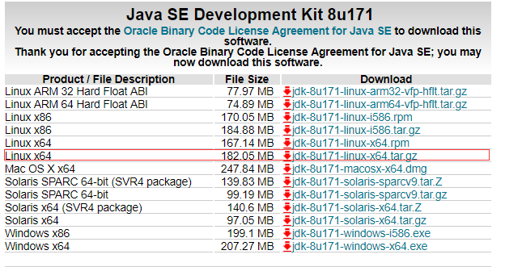

# centeros 安装 jdk1.8


> https://blog.csdn.net/u013452337/article/details/82589839


# 1.打开url选择jdk1.8下载
http://www.oracle.com/technetwork/java/javase/downloads/jdk8-downloads-2133151.html

我选择linux x64版本：



# 2.下载

```
wget http://download.oracle.com/otn-pub/java/jdk/8u171-b11/512cd62ec5174c3487ac17c61aaa89e8/jdk-8u171-linux-x64.tar.gz?AuthParam=1531155951_4e06a4d17c6c1dbfb8440352e19dd2ae
```

下载以后通过命令检查安装包大小是否符合

```
ls -lht
```

# 3.安装
（1）创建安装目录

```
mkdir /usr/local/java/
```


（2）解压至安装目录

```
tar -zxvf jdk-8u171-linux-x64.tar.gz -C /usr/local/java/
```

# 4.设置环境变量
打开文件

```
vim /etc/profile
```

在末尾添加

```
export JAVA_HOME=/usr/local/java/jdk1.8.0_171
export JRE_HOME=${JAVA_HOME}/jre
export CLASSPATH=.:${JAVA_HOME}/lib:${JRE_HOME}/lib
export PATH=${JAVA_HOME}/bin:$PATH
```

使环境变量生效

```
source /etc/profile
```

添加软链接

```
ln -s /usr/local/java/jdk1.8.0_171/bin/java /usr/bin/java
```


# 检查

```
java -version
```

```
[root@localhost etc]# java -version
java version "1.8.0_191"
Java(TM) SE Runtime Environment (build 1.8.0_191-b12)
Java HotSpot(TM) 64-Bit Server VM (build 25.191-b12, mixed mode)
```


