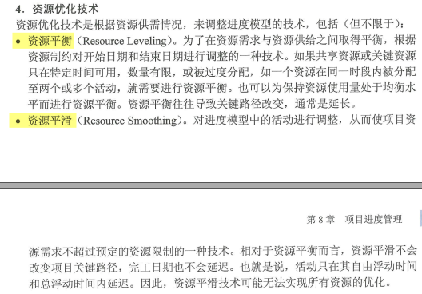

# 关键链法-资源优化技术

-----

### 4. 资源优化技术

资源优化技术是根据资源供需情况，来调整进度模型的技术，包括（但不限于）：
- **资源平衡（Resource Leveling）**。为了在资源需求与资源供给之间取得平衡，根据
资源制约对开始日期和结束日期进行调整的一种技术。如果共享资源或关键资源
只在特定时间可用，数量有限，或被过度分配，如一个资源在同一时段内被分配
至两个或多个活动，就需要进行资源平衡。也可以为保持资源使用量处于均衡水
平而进行资源平衡。资源平衡往往导致关键路径改变，通常是延长。
- **资源平滑（Resource Smoothing）**。对进度模型中的活动进行调整，从而使项目资
源需求不超过预定的资源限制的一种技术。相对于资源平衡而言，资源平滑不会
改变项目关键路径，完工日期也不会延迟。也就是说，活动只在其自由浮动时间
和总浮动时间内延迟。因此，资源平滑技术可能无法实现所有资源的优化。