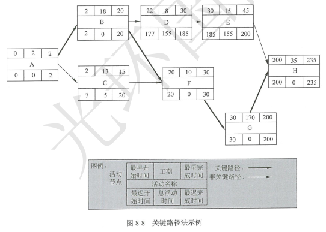

# 前导图法-活动节点


在前导图法中，每项活动有唯一的活动号，每项活动都注明了预计工期（活动的持续时间）。

通常，每个节点的活动会有如下几个时间：
- 最早开始时间 CEarliest Start time,ES ）
- 最迟开始时间 C Latest Start time, LS ）
- 最早完成时间（ Earliest Finish time, EF)
- 最迟完成时间（ Latest Finish time, LF ）

这几个时间通常作为每个节点的组成部分，

>根据英国标准BS6046所标识的节点

<table style='text-align: center;'>
<tr>
<td>最早开始时间<br>CEarliest Start time,ES ）</td>
<td>工期<br>（DU，表示工作持续时间）</td>
<td>最早完成时间<br>（ Earliest Finish time, EF)</td>
</tr>
<tr>
<td colspan="3">活动名称<br>（ID，表示工作代号）</td>
</tr>
<tr>
<td>最迟开始时间<br>（ Latest Start time, LS ）</td>
<td>总浮动时间</td>
<td>最迟完成时间<br>（ Latest Finish time, LF ）</td>
</tr>
</table>

### 总浮动时间(总时差)
```
总浮动时间
=最早开始时间ES-最迟开始时间LS
=最早完成时间EF-最迟完成时间LF
```

### 自由浮动时间（自由时差）
**“自由浮动时间”**是指在不延误任何紧后活动的最早开始时间且不违反进度制约因素的前提下，活动可以从最早开始时间推迟或拖延的时间量。其计算方法为：紧后活动最早开始时间的最小值减去本活动的最早完成时间 。例如，图 8-8 中，活动 D 的总浮动时间是 155 天，自由浮动时间是 0 天 。


