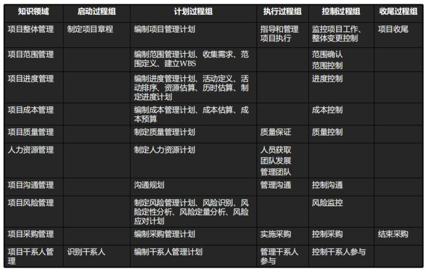

# 十五至尊图

> 10大知识域 - 5个过程组 - 47个过程的输入输出及工具

-|启动|计划|执行|控制|收尾
---|---|---|---|---|---
**整体管理**|制定项目章程|编制项目管理计划|指导和管理项目执行|监控项目工作 整体变更控制|结束项目或阶段
**范围管理**|-|规划范围管理 收集需求 定义范围 创建WBS|-|确认范围 控制范围|
**进度管理**|-|规划进度管理 定义活动 排列活动顺序 估算活动资源 估算活动持续时间 制定进度计划|-|控制进度|
**成本管理**|-|规划成本管理 估算成本 制定预算|-|控制成本|
**质量管理**|-|规划质量管理|实施质量保证|控制质量|
**人力管理**|-|规划人力资源管理|组建项目团队 建设项目团队 管理项目团队|-|
**沟通管理**|-|规划沟通管理|管理沟通|控制沟通|-|
**风险管理**|-|规划风险管理 识别风险 实施定性风险分析 实施定量风险分析 规划风险应对|-|控制风险|
**采购管理**|-|规划采购管理|实施采购|控制采购|结束采购
**干系人管理**|识别干系人|规划干系人管理|管理干系人参与|控制干系人参与|

## 一、项目整体管理

|过程名|输入|工具和技术|输出|
|---|---|---|---|
1、制定项目章程|1、项目工作说明书 2、商业论证 3、协议（合同，备忘录、意向及协议书） 4、组织过程资产 5、事业环境因素|1、专家判断 2、引导技术|1、项目章程
2、制定项目管理计划|1、项目章程 2、其他规划过程的输出 3、组织过程资产 4、事业环境因素|1、专家判断 2、引导技术|1、项目管理计划
3、指导与管理项目工作|1、项目管理计划 2、批准的变更请求 3、组织过程资产 4、事业环境因素|1、专家判断 2、项目管理信息系统（PMIS） 3、会议|1、可交付成果 2、工作绩效数据 3、变更请求 4、项目管理计划更新 5、项目文件更新
4、监控项目工作|1、项目管理计划 2、进度预测 3、成本预测 4、确认的变更 5、工作绩效信息 6、组织过程资产 7、事业环境因素|1、分析技术 2、项目管理信息系统 3、会议 4、专家判断|1、变更请求 2、工作绩效报告 3、项目管理计划更新 4、项目文件更新
5、实施整体变更控制|1、项目管理计划 2、工作绩效报告 3、变更请求 4、组织过程资产 5、事业环境因素|1、会议 2、变更控制工具 3、专家判断|1、批准的变更请求 2、变更日志 3、项目管理计划更新 4、项目文件更新
6、结束项目或阶段|1、项目管理计划 2、验收的可交付成果 3、组织过程资产|1、分析技术 2、会议 3、专家判断|1、最终产品、服务或成果 2、组织过程资产更新

## 二、项目范围管理

|过程名|输入|工具和技术|输出|
|---|---|---|---|
1、编制范围管理计划（规划范围管理）|1、项目管理计划 2、项目章程 3、组织过程资产 4、事业环境因素|1、会议 2、专家判断|1、范围管理计划 2、需求管理计划
2、收集需求|1、范围管理计划 2、需求管理计划 3、干系人管理计划 4、项目章程 5、干系人登记册|1、访谈 2、焦点小组 3、引导式研讨会 4、群体创新技术 5、群体决策技术 6、问卷调查 7、观察 8、原型法 9、标杆对照 10、系统交付图 11、文件分析|1、需求文件 2、需求跟踪矩阵
3、定义范围|1、范围管理计划 2、项目章程 3、需求文件 4、组织过程资产|1、产品分析 2、专家判断 3、备选方案生成 4、引导式研讨会|1、项目范围说明书 2、项目文件更新
4、创建工作分解结构（WBS）|1、范围管理计划 2、项目范围说明书 3、需求文件 4、事业环境因素 5、组织过程资产|1、分解 2、专家判断|1、范围基准 2、项目文件更新
5、确认范围|1、项目管理计划 2、需求文件 3、需求跟踪矩阵 4、核实的可交付成果 5、工作绩效数据|1、检查 2、群体决策技术|1、验收的可交付成果 2、变更请求 3、工作绩效信息 4、项目文件更新
6、范围控制|1、项目管理计划 2、需求文件 3、需求跟踪矩阵 4、工作绩效数据 5、组织过程资产|1、偏差分析|1、工作绩效信息 2、变更请求 3、项目文件更新 4、项目管理计划更新 5、组织过程资产更新

## 三、项目进度管理

|过程名|输入|工具和技术|输出|
|---|---|---|---|
1、规划进度管理|1、项目管理计划 2、项目章程 3、组织过程资产 4、事业环境因素|1、专家判断 2、分析技术 3、会议|1、项目进度管理计划
2、定义活动|1、进度管理计划 2、范围基准 3、组织过程资产 4、事业环境因素|1、分解 2、滚动式规划 3、专家判断|1、活动清单 2、活动属性 3、里程碑清单
3、排列活动顺序|1、进度管理计划 2、活动清单 3、活动属性 4、里程碑清单 5、事业环境因素 6、组织过程资产 7、项目范围说明书|1、前导图法 2、箭线图法 3、确定信赖关系 4、提前量与滞后量|1、项目进度网络图 2、项目文件更新
4、估算活动资源|1、进度管理计划 2、活动清单 3、活动属性 4、资源日历 5、风险登记册 6、活动成本估算 7、事业环境因素 8、组织过程资产|1、专家判断 2、备选方案分析 3、发布的估算数据 4、项目管理软件 5、自下而上估算|1、活动资源需求 2、资源分解结构 3、项目文件更新
5、估算活动持续时间|1、进度管理计划 2、活动清单 3、活动属性 4、活动资源需求 5、资源日历 6、项目范围说明书 7、风险登记册 8、资源分解结构 9、事业环境因素 10、组织过程资产|1、专家判断 2、类比估算 3、参数估算 4、三点估算 5、群体决策技术 6、储备分析|1、活动持续时间估算 2、项目文件更新
6、制定进度计划|1、进度管理计划 2、活动清单 3、活动属性 4、项目进度网络图 5、活动资源需求 6、资源日历 7、活动持续时间估算 8、项目范围说明书 9、风险登记册 10、项目人员分配 11、资源分解结构 12、事业环境因素 13、组织过程资产|1、进度网络分析法 2、关键路线法 3、关键链法 4、资源优化技术 5、建模技术 6、提前量和滞后量 7、进度压缩 8、进度计划编制工具|1、进度基准 2、项目进度计划 3、进度数据 4、项目日历 5、项目管理计划更新 6、项目文件更新
7、控制进度|1、项目管理计划 2、项目进度计划 3、工作绩效数据 4、项目日历 5、进度数据 6、组织过程资产|1、绩效审查 2、项目管理软件 3、资源优化技术 4、建模技术 5、提前量和滞后量 6、进度压缩 7、进度计划编制工具|1、工作绩效信息 2、进度预测 3、变更请求 4、项目管理计划更新 5、项目文件更新 6、组织过程资产更新

## 四、项目成本管理

|过程名|输入|工具和技术|输出|
|---|---|---|---|
1、制定成本管理计划（规划成本）|1、项目管理计划 2、项目章程 3、事业环境因素 4、组织过程资产|1、专家判断 2、分析技术 3、会议|1、成本管理计划
2、成本估算|1、成本管理计划 2、人力资源管理计划 3、范围基准 4、项目进度计划 5、风险登记册 6、组织过程资产 7、事业环境因素|1、专家判断 2、类比估算 3、参数估算 4、自下而上估算 5、三点估算 6、储备分析 7、质量成本 8、项目管理软件 9、卖方投标分析 10、群体决策技术|1、活动成本估算 2、估算依据 3、项目文件更新
3、成本预算（制定预算）|1、成本管理计划 2、范围基准 3、活动成本估算 4、活动依据 5、项目进度计划 6、资源日历 7、风险登记册 8、协议 9、组织过程资产|1、成本汇总 2、储备分析 3、专家判断 4、资金限制平衡 5、历史关系（参数模型）|1、成本基准 2、项目资金需求 3、项目文件更新
4、成本控制|1、项目管理计划 2、项目资金需求 3、工作绩效数据 4、组织过程资产|1、挣值管理 2、预测 3、完工尚需绩效指数（TCPI） 4、绩效审查 5、项目管理软件（PM软件） 6、储备分析|1、工作绩效信息 2、成本预测 3、变更请求 4、项目文件更新 5、组织过程资产更新 6、项目管理计划更新

## 五、项目质量管理

|过程名|输入|工具和技术|输出|
|---|---|---|---|
1、规划质量管理|1、项目管理计划 2、干系人登记册 3、风险登记册 4、需求文件 5、事业环境因素 6、组织规程资产|1、成本效益分析 2、质量成本法 3、七种基本质量工具 4、标杆对照 5、实验设计 6、统计抽样 7、其他质量管理工具 8、会议|1、质量管理计划 2、过程改进计划 3、质量测量指标 4、质量核对单 5、项目文件更新
2、实施质量保证|1、质量管理计划 2、过程改进计划 3、质量测量指标 4、质量控制测量结果 5、项目文件|1、质量审计 2、过程分析 3、质量管理与控制工具|1、变更请求 2、项目管理计划更新 3、项目文件更新 4、组织过程资产更新
3、质量控制（控制质量）|1、项目管理计划 2、质量测量指标 3、质量核对单 4、工作绩效数据 5、批准的变更请求 6、可交付成果 7、项目文件 8、组织过程资产|1、七种基本质量工具 2、统计抽样 3、检查 4、审查已批准的变更请求|1、质量控制测量结果 2、确认的变更 3、核实的可交付成果 4、工作绩效信息 5、变更请求 6、项目文件更新 7、项目管理计划更新 8、组织过程资产更新

## 六、项目人力资源管理

|过程名|输入|工具和技术|输出|
|---|---|---|---|
1、编制项目人力资源管理计划|1、项目管理计划 2、活动资源需求 3、事业环境因素 4、组织过程资产|1、组织结构图和职位描述 2、人际交住 3、组织理论 4、专家判断 5、会议|1、人力资源管理计划
2、组建项目团队|1、项目人力资源管理计划 2、事业环境因素 3、组织过程资产|1、事先分派 2、谈判 3、招募 4、虚拟团队 5、多维决策分析|1、项目人员分配表 2、资源日历 3、项目管理计划更新
3、建设项目团队|1、项目人力资源管理计划 2、项目人员分配表 3、资源日历|1、人际关系技能 2、培训 3、团队建设活动 4、基本规则 5、集中办公 6、认可与奖励 7、人事测评工具|1、团队绩效评估 2、事业环境因素更新
4、管理项目团队|1、项目人力资源管理计划 2、项目人员分配表 3、团队绩效评估 4、问题日志 5、绩效报告 6、组织文化和组织过程资产|1、观察和交谈 2、项目绩效评估 3、冲突管理 4、人际关系技能|1、变更请求 2、已更新的项目管理计划 3、项目文件更新 4、事业环境因素更新 5、已更新的组织过程资产

## 七、项目沟通管理

|过程名|输入|工具和技术|输出|
|---|---|---|---|
1、制订沟通管理计划（规划沟通管理）|1、项目管理计划 2、干系人登记册 3、事业环境因素 4、组织过程资产|1、分析沟通需求 2、沟通技术 3、沟通模型 4、沟通方法 5、会议|1、项目沟通管理计划 2、其他文档的更新
2、管理沟通|1、项目沟通管理计划 2、工作绩效报告 3、组织过程资产 4、事业环境因素|1、沟通技术 2、沟通模型 3、沟通方法 4、信息管理系统 5、绩效报告|1、项目沟通 2、更新的项目管理计划 3、项目文件更新 4、更新的组织过程资产
3、控制沟通|1、项目管理计划 2、项目沟通 3、问题日志 4、工作绩效数据 5、组织过程资产|1、信息管理系统 2、专家判断 3、会议|1、工作绩效信息 2、变更请求 3、更新的项目管理计划 4、更新的其他项目文件 5、组织过程资产更新

## 八、项目采购管理

|过程名|输入|工具和技术|输出|
|---|---|---|---|
1、编制采购管理计划（规划采购）|1、项目管理计划 2、需求文档 3、风险登记册 4、活动资源要求 5、项目进度 6、活动成本估算 7、干系人登记册 8、事业环境因素 9、组织过程资产|1、“自制/外购”分析 2、专家判断 3、市场调研 4、会议|1、采购管理计划 2、采购工作说明书 3、采购文件 4、供方选择标准 5、“自制/外购”决策 6、变更申请 7、可能的项目文件更 新
2、实施采购|1、采购管理计划 2、采购文件 3、供方选择标准 4、卖方建议书 5、项目文件 6、自制/外购决策 7、采购工作说明书 8、组织过程资产|1、投标人会议 2、建议书评价技术 3、独立估算 4、专家判断 5、刊登广告 6、分析技术 7、采购谈判|1、选择的卖方 2、合同 3、资源日历 4、变更请求 5、项目管理计划更新 6、项目文件更新
3、控制采购|1、项目管理计划 2、采购文件 3、合同 4、批准的变更请求 5、工作绩效报告 6、工作绩效数据|1、合同变更控制系统 2、检查与审计 3、采购绩效审查 4、报告绩效 5、支付系统 6、索赔管理 7、记录管理系统|1、工作绩效信息 2、变更请求 3、项目管理计划更新 4、项目文件更新 5、组织过程资产更新
4、结束采购|1、项目管理计划 2、采购文件|1、采购审计 2、采购谈判 3、记录管理系统|1、结束的采购 2、组织过程资产更新

## 九、项目风险管理

|过程名|输入|工具和技术|输出|
|---|---|---|---|
1、规划风险管理|1、项目管理计划 2、项目章程 3、干系人登记册 4、事业环境因素 5、组织过程资产|1、分析技术 2、专家判断 3、会议|1、风险管理计划
2、识别风险|1、风险管理计划 2、成本管理计划 3、进度管理计划 4、质量管理计划 5、人力资源管理计划 6、范围基准 7、活动成本估算 8、活动持续时间估算 9、干系人登记册 10、项目文件 11、采购文件 12、事业环境因素 13、组织过程资产|1、文档审查 2、信息收集技术 3、核对单分析 4、假设分析 5、图解分析 6、SWOT分析 7、专家判断|1、风险登记册
3、实施定性风险分析|1、风险管理计划 2、范围基准 3、风险登记册 4、事业环境因素 5、组织过程资产|1、风险概率和影响评价 2、概率和影响矩阵 3、风险数据质量评估 4、风险分类 5、风险紧迫性评估 6、专家判断|1、风险登记册 2、假设条件日志
4、实施定量风险分析|1、风险管理计划 2、成本管理计划 3、进度管理计划 4、风险登记册 5、事业环境因素 6、组织过程资产|1、数据收集和表示技术 2、定量分析和建模技术 3、专家判断|1、项目的概率分布 2、实现成本和实现目 标的概率 3、量化风险优先级清单 4、定量风险分析结果的 趋势
5、规划风险应对|1、风险管理计划 2、风险登记册|1、消极风险或威胁的应对策略 2、积极风险或机会的应对策略 3、应急响应策略 4、专家判断|1、项目管理计划更新 2、项目文件更新
6、控制风险|1、项目管理计划 2、风险登记册 3、工作绩效数据 4、工作绩效报告|1、风险再评估 2、风险审计 3、偏差和趋势分析 4、技术绩效测量 5、储备分析。 6、会议|1、工作绩效信息 2、变更请求 3、项目管理计划更新 4、项目文件更新 5、组织过程资产更新

## 十、项目干系人管理

|过程名|输入|工具和技术|输出|
|---|---|---|---|
1、识别干系人|1、项目章程 2、采购文件 3、事业环境因素 4、组织过程资产|1、组织相关会议 2、专家判断 3、干系人分析|1、干系人登记册
2、编制干系人管理计划（规划干系人）|1、项目管理计划 2、干系人登记册 3、事业环境因素 4、组织过程资产|1、组织相关会议 2、专家判断 3、分析技术|1、干系人管理计划 2、项目文件更新
3、管理干系人参与（管理干系人）|1、干系人管理计划 2、沟通管理计划 3、变更日志 4、组织过程资产|1、沟通方法 2、人际关系技能 3、管理技能|1、问题日志 2、请求变更 3、项目管理计划更新 4、项目文件更新 5、组织过程资产更新
4、控制项目干系人参与|1、项目管理计划 2、问题日志 3、工作绩效数据 4、项目文件|1、信息管理系统 2、专家判断 3、会议|1、工作绩效信息 2、变更请求 3、项目管理计划更新 4、组织过程资产更新 5、项目文件更新

## 十五至尊图：

