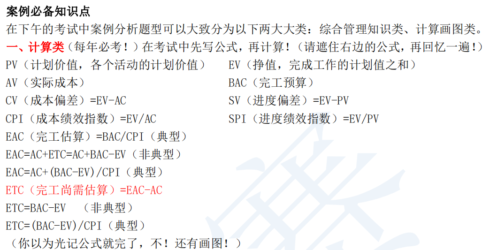

# 挣值管理 (EVM ）- 挣值计算汇总表

>挣值管理 (EVM ）是把范围、进度和资源绩效综合起来考虑，以评估项目绩效和进
展的方法。它是一种常用的项目绩效测量方法。它把范围基准、成本基准和进度基准整
合起来，形成绩效基准，以便项目管理团队评估和测量项目绩效和进展。作为一种项目
管理技术，挣值管理要求建立整合基准，用于测量项目期间的绩效。

缩写|名称|术语词典定义|如何使用|公式|对结果的解释
---|---|---|---|---|---
PV|计划价值|为计划工作分配的经批准的预算|为某一时点上，通常为数据日期或项目完工日期， 计划完成工作的价值||
EV|挣值|对已完成工作的测量， 用该工作的批准预算来表示|在某一时点上，通常为数据日期， 全部完成工作的计划价值、与实际成本无关|挣值=完成工作的计划价值之和|
AC|实际成本|在给定时间段内， 固执行项目活动而实际发生的成本|在某一时点上，通常为数据日期， 全部完成工作的实际成本||
BAC|完工预算|为将要执行的工作所建立的全部预算的总和|全部计划工作的价值，项目的成本基准||
CV|成本偏差|在某个给定时间点，预算亏空或盈余量， 表示为挣值与实际成本之差|在某一时点上，通常为数据日期， 完成工作的价值与同一时点上实际成本之间的差异|CV=EV-AC|**正数**＝在计划成本之内  **零**＝与计划成本持平  **负数**＝超过计划成本
SV|进度偏差|在给定的时间点上，项目进度提前或落后的情况， 表示为挣值与计划价值之差|在某一时点上，通常为数据日期， 完成工作的价值与同一时点上计划完成的工作之间的差异|SV=EV-PV|**正数**＝提前于进度计划  **零**＝在进度计划上  **负数**＝超过计划成本
VAC|完工偏差|对预算亏空量或盈余量的一种预测， 是完工预算与完工估算之差|项目完工成本的估算差异|VAC=BAC-EAC|**正数**＝在计划成本之内  **零**＝与计划成本持平  **负数**＝超过计划成本
CPI|成本绩效指数|度量预算资源的成本效率的一种指标， 表示为挣值与实际成本之比|CPI等于1.0说明项目完全按预算进行， 到目前为止完成的工作的成本与预计使用的成本一样， 其它数值则表示已完工作的成本高于或低于预算的百分比|CPI=EV/AC| `>1`在计划成本之内 `=1`与计划成本持平 `<1`超过计划成本
SPI|进度绩效指标|测量进度效率的一种指标， 表示为挣值与计划价值之比|SPI等于1.0说明项目完全按照进度计划执行， 到目前为止， 已完成工作与计划完成的工作完全一致。 其他数值则表示已完成工作落后或提前与计划工作的百分比|SPI=EV/PV|`>1`提前于进度计划 `=1`在计划进度上 `<1`落后于进度计划
EAC|完工估算|完成所有工作所需的预期总成本， 等于截至目前的实际成本加上完工尚需估算|如果预计剩余工作的CPI与当前的一致， 则使用这个公式计算EAC： 
 如果剩余工作将以计划效率完成，则使用： 
 如果原计划不再有效，则使用： 
 如果CPI和SPI同时影响剩余工作，则使用：|EAC=BAC/CPI 
 EAC=AC+BAC-EV 
 EAC=AC+自上而下估算的ETC 
 EAC=AC+[(BAC-EV)/(CPI*SPI)]|
ETC|完工尚需估算|完成所有剩余项目工作的预计成本|假设工作正按计划执行， 则使用这个公式计算完成剩余工作所需的成本： 
 对剩余工作进行自下而上重新估算|ETC=EAC-AC 
 ETC=再估值|
TCPI|完工尚需绩效指数|为了实现特定的管理目标， 剩余资源的使用必须达到的成本绩效指标， 是完成剩余工作所需的成本与剩余预算之比|为了按计划完成，必须维持的效率： 
 为了实现当前的完工估算（EAC），必须维持的效率|TCPI=(BAC-EV)/(BAC-AC) 
 TCPI=(BAC-EV)/(EAC-AC)|`>1`很难完成 `=1`正好完成 `<1`很容易完成 
 `>1`很难完成 `=1`正好完成 `<1`很容易完成

