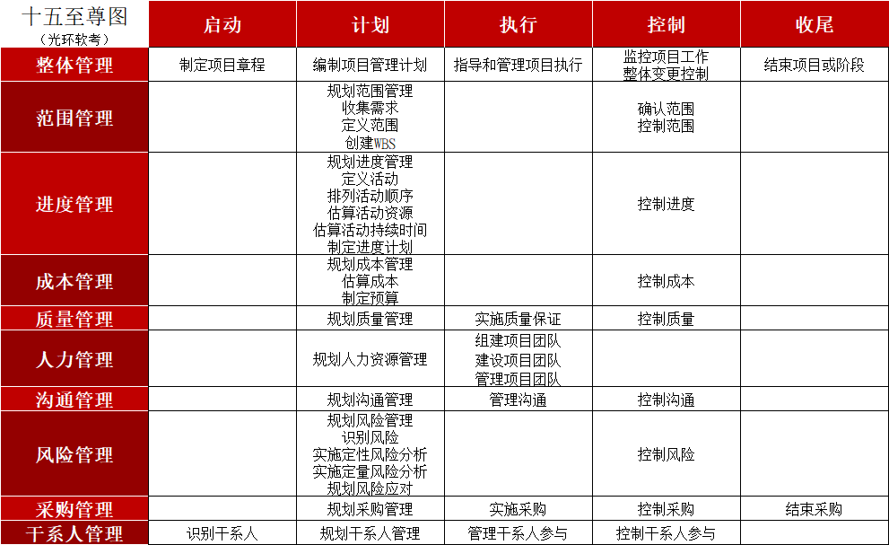

# 软考

## 考试

-|题型|数量|考试时间|做题时间|及格/部分
-|-|-|-|-|-
中级|单选题|75题|09:00~11:30|150分钟|45分/75分
中级|案例题|4题|14:00~16:30|150分钟|45分/75分
-|-|-|-|-|-
高级|单选题|75题|09:00~11:30|150分钟|45分/75分
高级|案例题|3题|13:30~15:00|90分钟|45分/75分
高级|论文|2选1|15:20~17:20|120分钟|45分/75分

## 考试大纲

-|信息技术类|项目管理类
-|-|-
|信息化和信息系统|项目管理基础知识
|法律法规|项目管理十大知识域
|标准规范|项目管理辅助知识
|运筹学（数学题）-高级|项目管理高级知识-高级
选择题|30分|40分
案例题||75分
大论文||75分

## 十五至尊图

